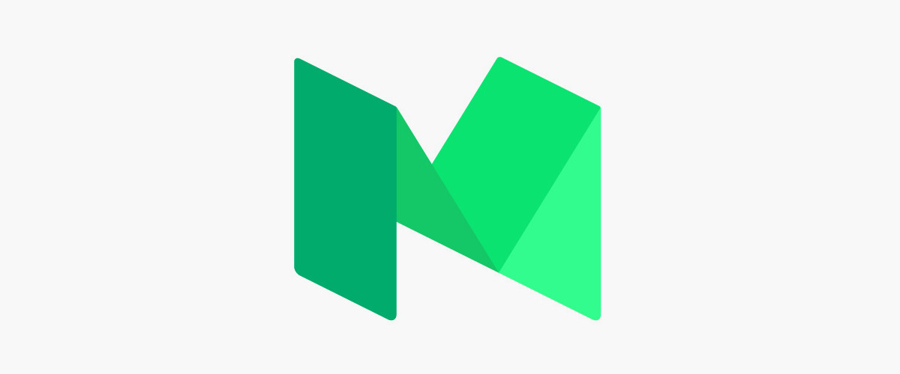
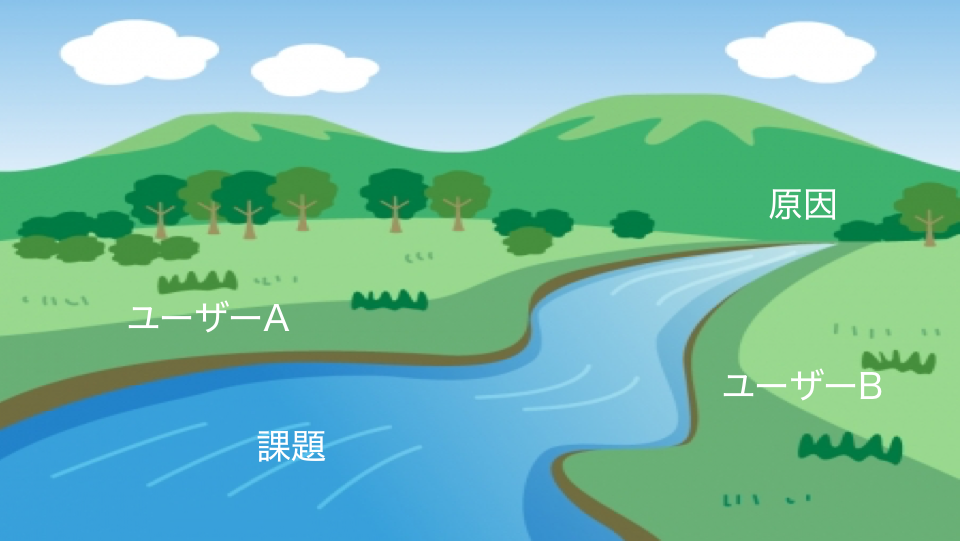

autoscale: true

# [fit] Mentors School #1

---

# 今日の概要

- セルフマネジメント
  - キャリアの考え方
  - 情報取集と発信の方法
- サービス開発
  - アイディアの作り方

---

# 導入
講義の初めということで、以下の２つをやっていこうかと思います。

- キャリアから考えて自分を売り込みためのサービス開発をする意義
- どんなものを作りたいかの方針決める。

---

# [fit] SELF MANAGEMENT

---
# [fit] とはいえ、エンジニアとして意識することってなに？

---

エンジニアとしてのキャリアを踏み出すにあたってこれから考えないといけないことがいくつかあります。

1. スキルは、所有物であるという姿勢
2. 自分が商品であるということを理解する
3. 学び続けなければいけないということ

これは、Soft Skillsというエンジニアのキャリアについて書かれた本から抜粋したテーマです。とてもいい本なので機会があったら読んでみるといいと思います。

---

## スキルは所有物であるという姿勢。
  -  エンジニアのスキルは世界中で共通で、その会社に依存してしまうスキルは少ない。
  - 転職する人が多い業界ですが、それはこの業界の流れが速いからです。そのためにもスキルという概念をしっかりと持って自分にできることとできないことを自覚をしなければなりません。
  - スキルというのは、所有物でありすぐにどこでも働けるエンジニアが理想的だと言えます。

---
## 自分が商品であるということを理解する
  - エンジニアのスキルは良くも悪くも評価しやすいので、常に自分にどれくらい価値があって、どれくらいの評価を受けてるかを考えなければいけない。
  - そのためにも自分をブランド化することが重要でそのためにも「話す能力」をつける必要がある。
  - 自分が作ったものや自分が開発したものは、会社に帰属するものなのか自分のものなのかというのは意識する必要がある。

---

## 学び続けなければいけないということ。
- この業界は流れも早く、次々に新たなことを学び続けなければいけない。そのためにも「自分の中での学ぶ方法」を見につけることが重要。

- 情報収集の方法や情報発信の方法を身につけることが重要である。

---

では、次に入社したあとの自分のキャリアについて考えてみましょう。エンジニアとして入った後に、部署の移動や転職などによって、次に何をやりたいかを考えてみましょう。
　主に、最初の就職は今できることを、その後にやることがあなたが本当にやりたいことになるようなキャリアの積み方ができることが良いのではないでしょうか？
最初から自分のやりたい職を一直線に目指さない方がいい理由は2つあります。

---

## [fit] 最初のキャリアではまずは信頼を築いてほしい
- 1つは仕事上の、職場での信頼
- もう1つは、社会的な実績です。当然、社会的な実績には金銭的な信頼も含まれます。

---

## [fit] あなたが憧れている仕事が実際には思い描いていたものと違う場合があるから

- 最初自分のできる仕事をやる中で余裕をもって自分がやりたいと思う仕事を観察するといいでしょう。そのうえで、実際にその仕事に付くにはどのようなことが必要なのかよく調べることをおすすめします。

---

# [fit] 要するにエンジニアにも営業力が必要

---

# [fit] ACTIVITY

---
## 自分を商品だと考える。
商品にはどんな情報が含まれるでしょうか？

- 商品名
- 値段
- 商品のカテゴリー
- 商品の説明
- ロゴ
- 誰向けの商品か
- 他製品との比較

---

# [fit] THINKING TIME

---

# [fit] REVIEW TIME

---

## [fit] "エンジニアは、一生学ぶ"

---

# [fit] 情報収集と情報発信

---

# [fit] 情報収集の方法

---

## 重要性
- トレンドの技術は毎年変わる。
- ある程度、全ての範囲(フロント、バック、インフラ)の知識が必要とされるようになった。
- webの技術がモバイルにきたり、インフラの考えが流れ込んでくることもザラになった。
- OSSなどの影響で急速に知見がオープンになりつつある。手に入りやすいし手にしてる人が多い。-> 差別化、生きて行くために勉強が必要

---

## なにを？
- 考え方や大枠の概要
- 最近のトレンドが何でそのメリットデメリット

---

## どこで？
- 自分の興味のある分野の話題の技術書はとりあえず買っとく。
- 技術書展に出てる本は一読する。(安いし、最近の話題が網羅できる)
- Qiitaの最近の投稿を追う。
- Twitterなどで著名人はフォローする
- 他人のGithub上でのアクティビティを見る → 特に他人がつけたstarはよく見る。
- 今をときめいてる会社のエンジニアブログ → Wantedly, クックパッドなどのエンジニアブログはとてもいい内容が書いてある場合が多い。

---

## 情報の寿命を考える
- ブログやQiitaなどは、長くても半年から1年
- 本は割と長め(当然分野による)

---

## [fit] 情報発信の方法

---

## なぜ？
- 発信することで自分の整理になる
- エンジニアの価値をあげることができる。-> ブランド化

---
## Qiita
- 割と気軽に書ける。
- 詳細を書かなくてもいい風潮にある。

---

## はてなブログ
- 結構質の高い記事必要。
- どちらかといえば、重めの記事が集まってる。技術色の高い記事が多い。

---

## medium
- 考えや抽象的な記事が多い。
- 誰かに見せるというより整理に近い気がする。

---

## 個人ブログ
- 自分のブログとして公開することができる。
- また、インターン・就活でそのurlを提示することができる。
- 自分だけの閉じた世界なので、気兼ねなく自分の好きなことを書ける。

---

# [fit] サービス開発

---

## 自分を売り込むためのサービスを考える

- 自分のキャリアについて考える（技術系/マネジメント系）
- アピールしたいことを明確にする
- サービスを作ることで成長する

---

# アイデアの作り方

今回は、サービス開発を行う際のアイデアだしについてお話します。
ただし、具体的なアイデア出しの方法については細かく話しません。

---

## アイデア作りの段取り

1. 目的決め
2. 調査
3. アイデア出し

---

### なぜアイデアを出すのか？

サービス開発においてアイデアを出すとは、そもそもどういう状況でしょうか？
主にサービス開発のアイデア出しのシチュエーションでは以下のようなものがあると思います。

---

## アイデア出しの目的

1. 手元にプロダクトも何もない場合
  1. お金を儲けることが目的
  2. CSRが目的
2. 既にリリースをしている場合
  1. プロダクトを良くすることが目的なアイデア
  2. サービスの方針転換が目的

---

### お金儲けが目的のアイデア

ゴール1：マネタイズ
ゴール2：コストを削減する

---

### CSRが目的なアイデア

ゴール：知名度の向上（名前・技術・思考など）

---

###　プロダクトを良くすることが目的なアイデア

ゴール：KPIなどの数字を改善することが目的

---

### サービスの方針転換が目的なアイデア

ゴール：サービスのマネタイズ

---

## 調査

アイデアを出すのに必要な調査を行います。
調査では、1で定めたゴールを達成するための調査を行います。

---

### 調査のポイント

1. 現在の状況を知ること
2. 課題を見つける
3. ボトルネックを探す

---

---

課題は下流から分からないが、原因は上流にある

もし、もっと上流の課題を知りたければ、課題への理解を深めなければいけない

---

同じ課題を見ていても、川の左側の民族と、右側の民族では課題への意識が違う

---

### 課題への考え方

- ボトルネックを取り除くだけが解決方法ではない
- ボトルネックは1つとは限らない
- 全員を一斉に救おうとしない
- 課題の見え方は人によって違う
- 今解決したい課題以外は最低限にしか考えない

---

## アイデア出し

---

### アイデアとは

アイデアとは、課題を解決するための手段の１提案
１つのアイデアで全ての課題を解決する必要はない

---

### アイデア出しのポイント

1. 理詰めで出す
2. かけ合わせで出す
3. 置き換えで出す
4. 文化を輸入する
5. 量を出す

---

### 1. 理詰めで出す

- 個々のボトルネックの対処方法を考える
- 課題をユーザーのペルソナを立てて考える

---

### 2. かけ合わせで出す

- 「良いもの✕良いもの」の掛け合わせ
- 「悪いもの✕悪いもの」の掛け合わせ

---

### 3. 置き換えで出す

- 既にあるものを置き換えたものを考える
- 置き換えが可能かを考える
- 現代の人が知らないものを考えるといい
- 全部置き換えるのではなく、コアな楽しさの部分だけを置き換える

---

#### 例

- レゴ -> マインクラフト
- 福笑い -> Snapchat
- お見合い写真 -> Tinder

---

### 4. 文化を輸入する

課題への考え方はユーザーによって違うため、自分とは全く違う人達が同じ課題に対してどのようにアプローチをしてきてのかを真似する

そして、課題へのアプローチを方程式へと落とし込む

---

### 5. 量を出す

- ダメなアイデアから出す
- 毎回深掘りをしない

---

#### 例

ご飯のお店を提案する時にマックや相手がないと思っているものから提案することでその後の建設的なアイデアを引き出したり。
まずは1つめをなんでもいいから出すことが重要。

---

### シンプルにアイデアを出す

マインドマップを使ったアイデア出し
[https://coggle.it/](https://coggle.it/)

---

### アイデアをまとめる

アイデアを人に伝えるために文章や絵として整理する
[https://workflowy.com/](https://workflowy.com/)

---

## ACTIVITY

---

実際に3ヶ月を目標に、自分を最も売り込めるアイデアを目的にして新規に考えましょう！
今回は使用する技術から詰めていくことでアイデアのスコープが狭まります

---

### レビュータイム

出来た人から個別にレビューをしていきます。

---
