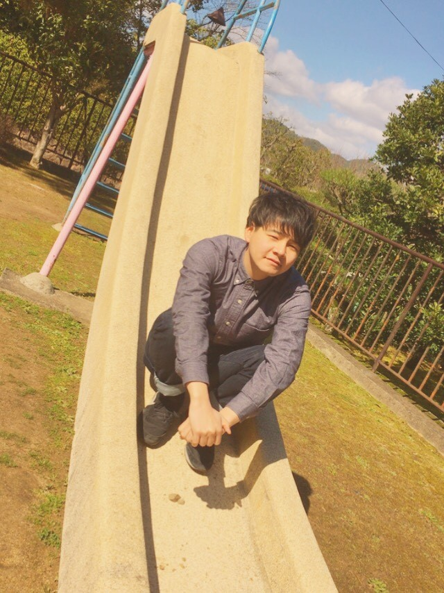
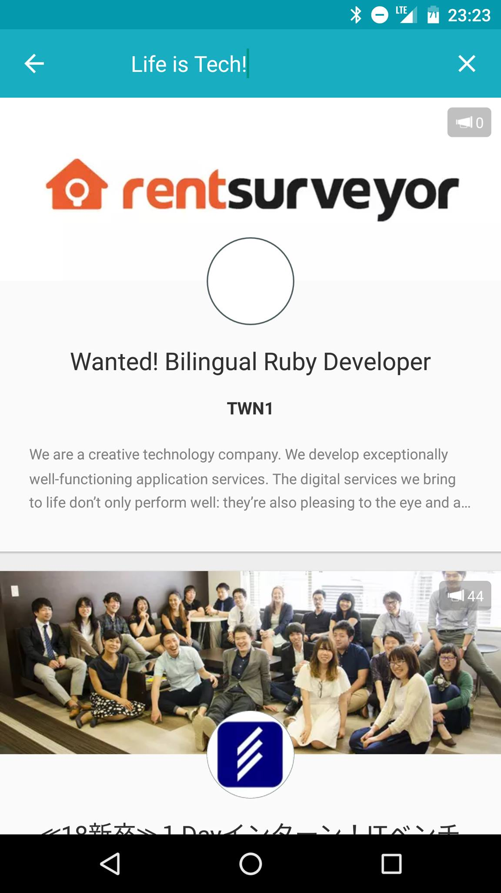
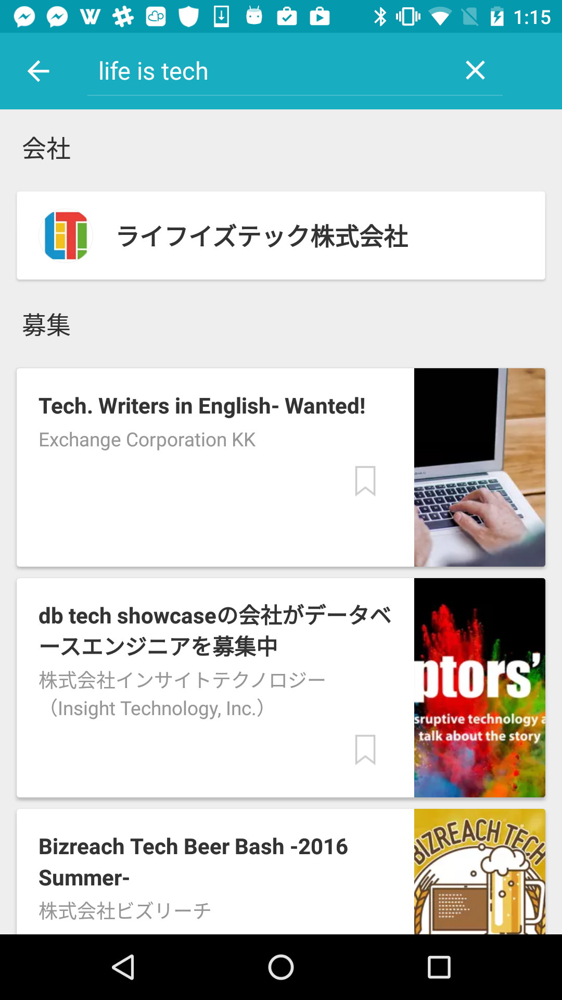
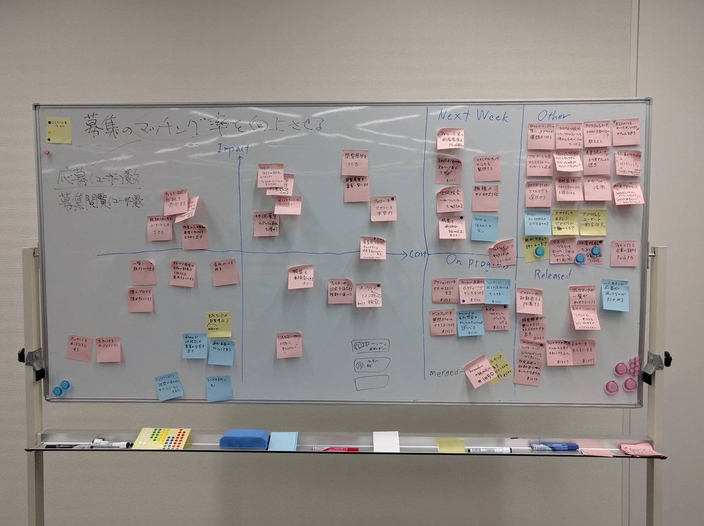
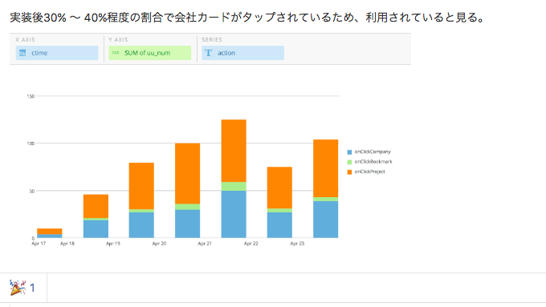
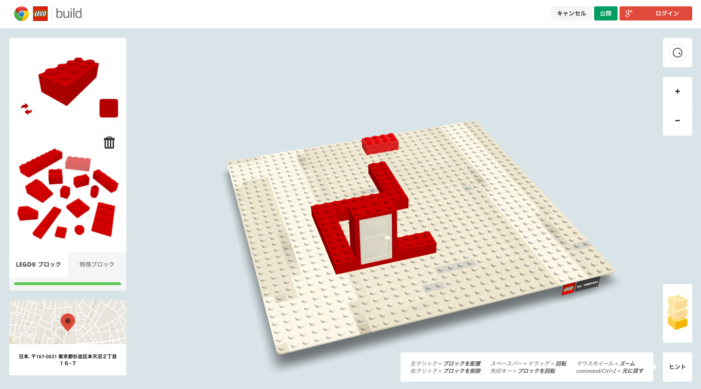
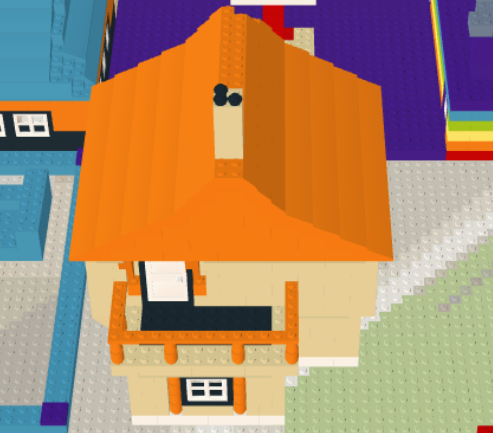
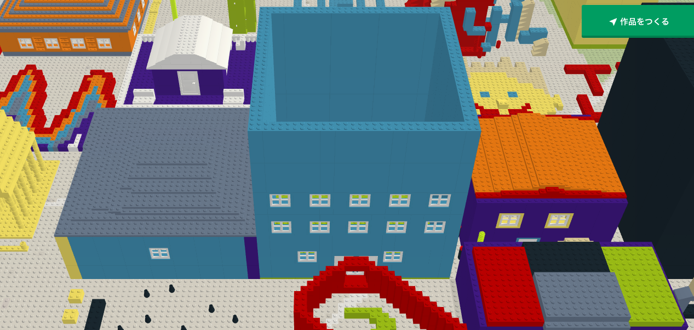

autoscale: true

# [fit] Activity
## [fit] 開発フロー体験

---

# 自己紹介
- さぶうぇい
- 7期 Androidアプリ開発コース
- MentorsSchool運営メンバー

---

# 経歴
- 大学でソフトウェア開発を研究(4年生です)
- 実務経験
 - Wantedly,incでAndroidエンジニアの長期インターンシップ
 - 知り合いの手伝いでrailsを2,3ヶ月書いてた。
 - Sonyのインターンシップ
 - 9月は1ヶ月DeNAでAndroidエンジニアのインターンシップ予定

---

---

## [fit] 今日はグロースハックというものを体験してもらいます

---

## グロースハックとは

> プロダクトやサービスのグロースにフォーカスし、製品のマーケティングや全社的な戦略の課題をクリエイティブに解決すること

## [fit] 「サービスをよりよいものに成長させていく」

---

## [fit] Wantedlyでのグロースハック

---

## 実際に行ってるグロースのサイクル

1. ユーザーの動向を数字で出して分析する
1. 数値を元に仮説を立てる
1. タスクに変換する
1. タスクを整理する
1. 実装する
1. 仮説が正しかったかどうかの検証をする

---

## 1 ユーザーの動向を数字で出して分析する

Wantedlyでは、クリックしたかどうかを始めとして、その画面にどれだけ滞在したかまでログに残しています。

右の"DOMO"と呼ばれるサービスで誰でもログを可視化することができ、それを見て「どうすればユーザーが増えるか」を常に考えています。

---

## 2 数値を元に仮説を立てる

 数値を見た上で、課題を考え、何が改善されればその課題が解決するかを考えます。

例:
検索のログから会社名が多く検索されてることがわかりました。
その時のアプリの実装では会社名で検索されても会社名に関係のない募集が出たりしていて

*「検索画面が使いにくく、ユーザーがあまり利用していない」*

と仮説が立てられました。

---

### このような形で会社検索が入るように実装が変更されました。

---

## 3 タスクに変換する

それだけでは、実装に入れないのでタスクに変換していきます。
Wantedlyでは、原始的な形で「見える化」をしています。

---

## 4 タスクを整理する

実装にかかる**コスト**と**インパクト**によってタスクの優先順位などを整理していきます。

---

## 5 実装する

実装します。

## [fit] **ここが唯一のエンジニアリングの部分です。**

---

## 6 仮説が正しかったかどうかの検証をする

- その後リリースをして実際にユーザーに使ってもらいます。
- ログを一定期間見て仮説が正しかったのかを検証します。

---

## [fit] このプロセスを体験してもらいます。

---

# Activityの内容

"Build with Chrome"を使ってチームになってレゴでユーザーが求めている家を立ててもらいます

---

---

---

# ペルソナ (ユーザー)

YKさん  
そろそろ家族も増え、仕事も安定してきたため、新しく家を買うことにしました。

- 新しい家は、家族3人が住める十分な大きさと、家でも~~謎を考える~~仕事をするため自分だけの書斎が欲しいと考えています。
- 移動はもっぱら愛用の白い自転車だが、ゆったりとした駐輪場が欲しい。

---

# 条件
- 家は、ユーザの要求を満たす必要があります。
- 最も主張したいフロアの断面図を作ってください。
- 実際にユーザーに対して家を売るつもりで作ってください。

---

# Activityの流れ (60min)
- ユーザー要求の分析[10min]
- タスクの書き出し[5min]
- 優先順位を決める[10min]
- 実装する[20min]
- 軽い発表をしてもらう+質疑応答[15min]
  - ユーザー要求の分析
  - 実装した家の披露

---

# [fit] Activity Start
- ユーザー要求の分析[10min]
- タスクの書き出し[5min]
- 優先順位を決める[10min]
- 実装する[20min]

---

# [fit] DEMO
- ユーザー要求の分析
- 実装した家の披露

---

# [fit] 今回のActivityとサービス開発の関連
1. ユーザーの動向を数字で出して分析する
  -> ペルソナの要求を分析する
1. 数値を元に仮説を立てる
  -> 要求を満たすかどうかを考える
1. タスクに変換する
  -> タスクとして書き出す
1. タスクを整理する
  -> 優先順位を決める
1. 実装する -> 組み立てる
1. ~~仮説が正しかったかどうかの検証をする~~ -> 今回はなかった
