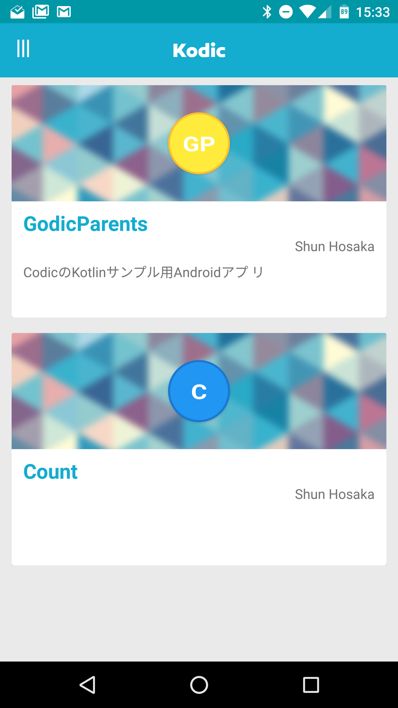
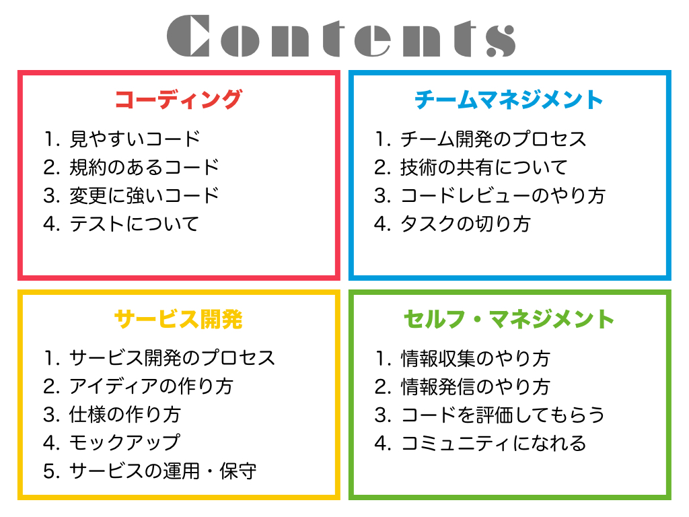
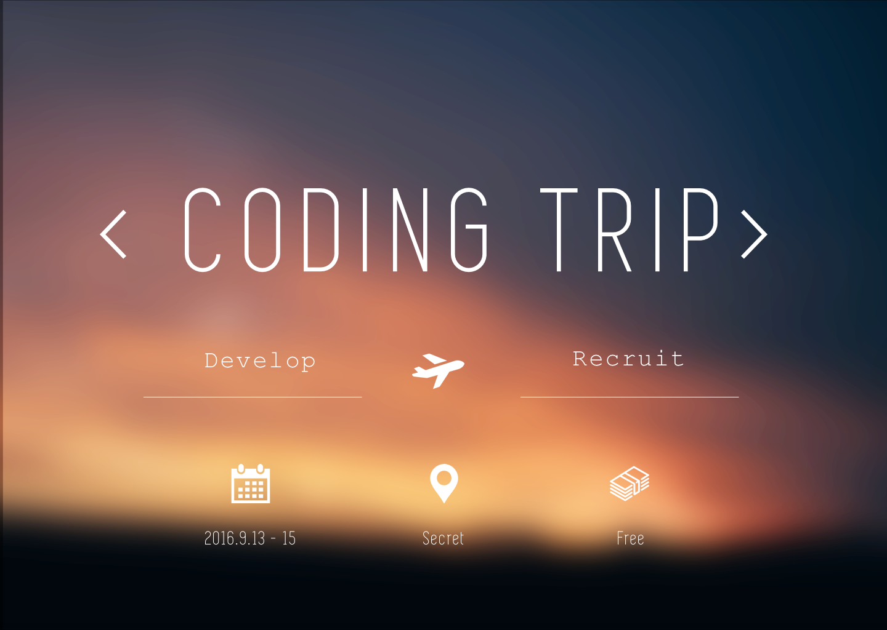

# MentorsSchool説明会

---

## 今日の流れ

- 概要
- ワークショップの内容について
- ワークショップのゴール
- スケジュールや費用について

---

## 概要

MentorsSchoolは、実際のサービス開発を通して自分のコードを良くしていくことや、サービス作りのフローを学習することを目的としたワークショップ兼もくもく会となります。

今回は分かりやすく、リクルーティングリポジトリというリポジトリ作成を通して考えます。

---

### リクルーティングリポジトリって？

リクルーティングリポジトリは、Recruit + Repositoryの造語です。
つまり、就活や転職などの際に他人に見せるようのリポジトリのことです。

---

### なぜ、就活にリポジトリ？

企業の人は、採用の時点でその人がどれだけレベルかを知りたいと思っている。
特に、面接でのコーディングなどと違い、普段から書いているコードにはその人の**クセ**が出るので、それを見たい

---

### 実際にリポジトリの提出を求められるのか？

- Cyber Agent
- DeNA
- mixi
- Wantedly
- リクルート
- Yahoo japan　などなど
※運営陣調べ

---

### リポジトリを通して伝わること、伝えること

- プロジェクトの設計について
- ライブラリを選択した理由
- コードの意味（局所的にも、全体的にも）
- こだわったポイント

---

### サンプル

実際に提出したリクルーティングリポジトリ

KodicというAPIを使った簡単な辞書アプリ

https://github.com/Reyurnible/kodic



---

## ワークショップの内容について

---



---

###「 どんなプログラマーでもコンピュータに理解できるコードは書ける。しかし優秀なプログラマーだけが、人間に理解できるコードを書くことができる。」

#### ～Martin Fowler～

---

### 学んでほしいこと

1. よいコードとは何か
2. サービス作りに必要なこととは何か

----

## ワークショップのゴール

1. 現役エンジニアに負けない技術力を身につける
2. 力があることを周囲に示す
3. 自分の作りたかったものを作る！！

---

## でも、やりたいことは1つ

---

### :beer: 楽しく、いいものを作ろう :beer:

---

## スケジュール

---

### ワークショップ

**9月の第4週からスタート！！**

- 隔週で全6回を予定
- 細かい曜日や、日程などは参加者が確定した後に検討

---

### 逆求人イベント

12月か1月に予定

Life is Tech !の協賛企業を始め、多くの企業を呼んで行う予定。
みんなが作ったものや書いたコードを、その場で企業の人に売り込むので、内定にもつながりやすい！！

---

### ワークショップの料金

半期: 15000円

---

### ワークショップの料金

~~半期: 15000円~~
半期：7500円

```
※ライフイズテックが半分を負担
```

---

## 質問タイム

---



---


### キックオフ旅行
MentorsSchoolの講師、運営、参加者で2泊3日で開発合宿に行きます。内容はチームでやる何かを予定しています。
(参加者や人数によって、検討)

徹夜やデスマーチがつきものの開発合宿とは違って、ゆったりとした環境で心ゆくままにコーディングをする合宿です。

こちらの応募はもう少し先になります。(8月中くらい)
