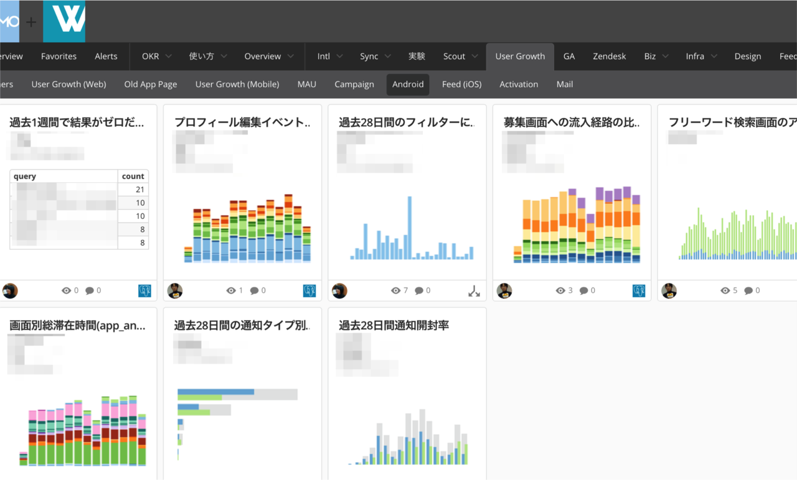
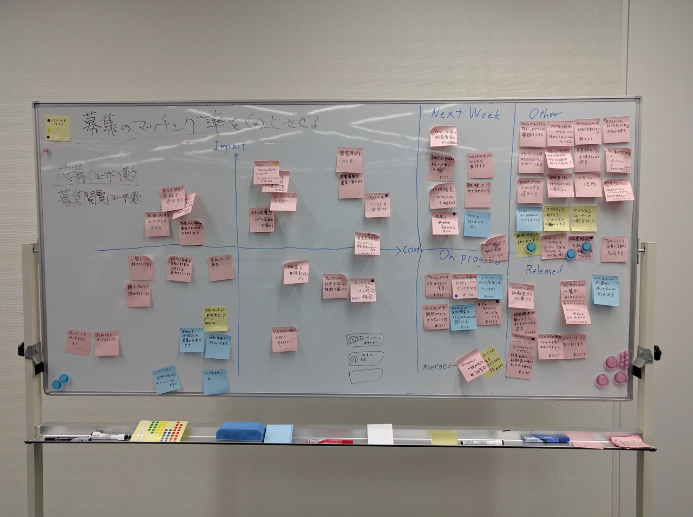
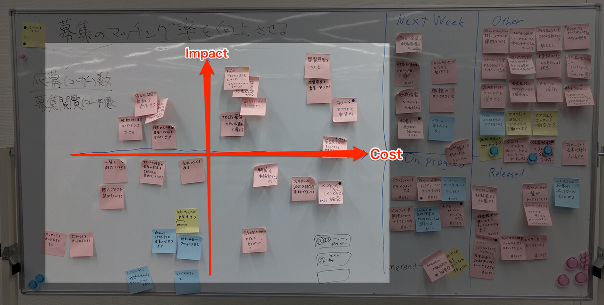

autoscale: true

# [fit] Activity
## [fit] 開発フロー体験

---

# 自己紹介
- さぶうぇい
- 7期 Androidアプリ開発コース
- MentorsSchool運営メンバー

---

# 経歴
- 大学でソフトウェア開発を研究(4年生です)
- 実務経験
 - 知り合いの手伝いでrailsを2,3ヶ月書いてた。
 - Sonyのインターンシップ
 - Wantedly,incでAndroidエンジニアの長期インターンシップ
 - 9月は1ヶ月DeNAでAndroidエンジニアのインターンシップ予定

---

## [fit] Wantedlyでのグロースハック

---

## 1 ユーザーの動向を数字で出して分析する

ユーザーのアクションやMAUなどをログに残して、それをグラフ化して見えるようにしています。

---

## 2 数値を元に仮説を立てる

 数値を見た上で、課題を考え、何が改善されればその課題が解決するかを考えます。

---

## 3 それをタスクレベルに落とし込む

それだけでは、実装に入れないのでタスクレベルに落とし込んでいきます。
Wantedlyでは、原始的な形で「見える化」をしています。

---

## 4 実装コストとインパクトを考えてタスクを整理する

実装にかかるコストとインパクトによってタスクの優先順位などを整理していきます。

---

## 5 実装する

実装します。

## [fit] **ここが唯一のエンジニアリングの部分です。**

---

## 6 仮説が正しかったかどうかの検証をする

その後リリースをして実際にユーザーに使ってもらいます。

そのログを一定期間見て最初に立てた仮説が正しかったのか、課題は解決されたのかを検証します。

---

## [fit] これに似たフローを体験してもらおうと思います。

---

# Activityの内容
- チームで分かれてもらう(4人くらい？)
- "Build with Chrome"を使ってレゴで家を立ててもらう
- サービス開発フローのロールプレイング

---

![] (screenshot_sample.png)

---

![inline] (screenshot_sample_buildings1.png)

---

![inline] (screenshot_sample_buildings2.png)

---

# 家について
- 家は、ユーザからの要求を満たす必要がある。
- 1階建ての家を作る
- サービス開発を意識して欲しい
- 実際に顧客に対して家を売るつもりで

---

# Activityの流れ
- ユーザーの要求を分析する
- タスクをポストイットに書き出す
- コストとインパクトで分類する
- 実装する(10minくらい)
- 軽い発表をしてもらう(実際に作った家とタスクボード)
  - 何を意識したか
  - ユーザーの要求をどう捉えたか

---

# [fit] Activityと実際のサービス開発の関連
1. ユーザーの動向を数字で出して分析する
  -> ユーザーの要求を分析
1. 数値を元に仮説を立てる
  -> 要求を満たすかどうかを考える
1. それをタスクレベルに落とし込む
  -> タスクとして書き出す
1. 実装コストとインパクトを考えてタスクを整理する
  -> 優先順位を決める
1. 実装する -> 組み立てる
1. ~~仮説が正しかったかどうかの検証をする~~ -> 今回はない

---

# ユーザーからの要求
- 開放感
- 2人で住みたい

---

# [fit] Activity Start

---

# [fit] DEMO
