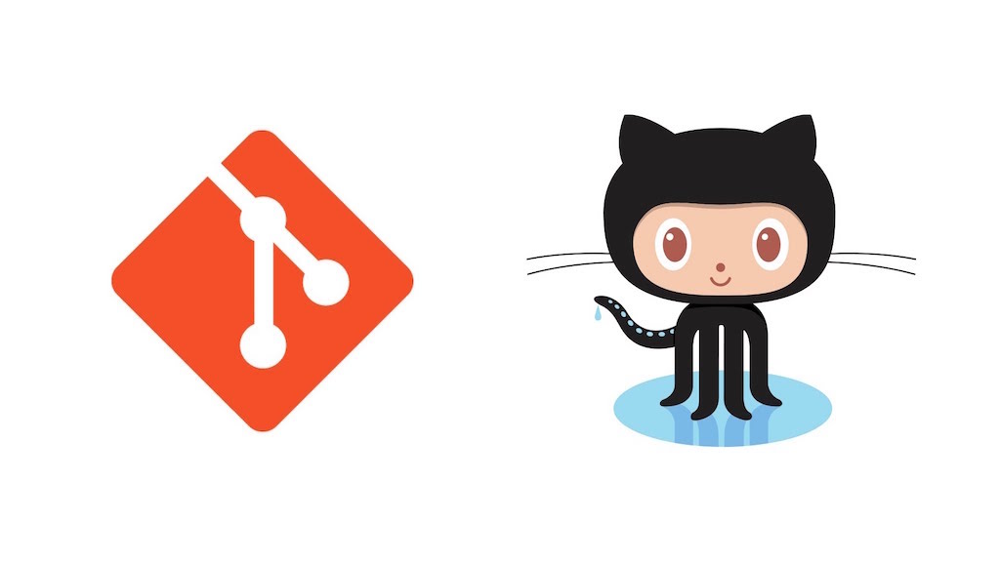
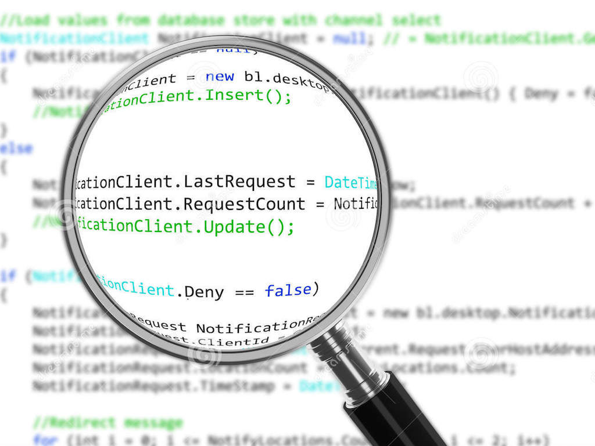

autoscale: true

---

## 今日やること
- セルフマネジメント
  - モチベーションの保ち方
- チームマネジメント
  - チーム開発とは
  - 技術共有について
  - チームでのタスクのこなし方
  - チームで行うコードレビュー

---

## [fit]モチベーションの保ち方

---

## モチベーションの保ち方

- 目標を作る
- 仲間を作る
- 習慣化する

---

### 目標を作る

程よい達成感が重要！
そのため、自分の中である目標とそれを達成した際に得られる得点を考えましょう。

また、目標を定めたらそれを誰かに言うようにしましょう。

---

### 目標を作る時の注意

- 大きな目標から考え、小さな目標に分割をする
- 実現可能な目標を立てる
- 人に言える目標にする
- 目標を達成した時の褒美を考えよう

---

### 仲間を作る

人を巻き込むことで、早く効果的を得る！
仲間には主に以下の2つの役割があります。

1. お互いを励ます役割
2. お互いを監視する枠割

ただし、仲間はなるべく対応な相手を選ぶ方がいいでしょう。
特に相手がサボった場合に、それに釣られて自分がサボってしまわないように注意が必要です。

---

### 習慣化する

タスクをこなすタイミングにルールを設ける！
辛いと思っていることでも習慣化させることができれば、次その習慣をやめることが気持ち悪くなるので長く続きます。

---

## [fit]生産性の保ち方

---

## 生産性の保ち方

- 現状の生産性を知る
- 雑念を排除する
- 計画を立てる

---

### 現状の生産性を知る

自分が1時間や1日という決められた時間の中で、どれだけの仕事を行うことができるのかを正確に知ることは非常に重要なことです。

---

### 雑念を排除する

タスクをこなす中で様々なタスクの割り込みが発生しますが、そのタスクの割り込みをどのようにして排除するかが重要になります。
今は、何をやらなければ行けないのかを明確にし、それに必要なもの以外は全て削ぎ落としましょう。

---

### 計画を立てる

週の計画、月の計画、クオーターの計画、年の計画
といったようにそれぞれ期間を分けて計画を立てて、タスクを消費しましょう。
特に、計画には具体的なやることの数字と、その計画が達成すると何が得られるのかを考えてみましょう。
マイルストーンも同じような考えになります。

---

## [fit]実際の手法

---

### ポモドーロ・テクニック

フランチェスコ・シリロが1980年代に開発した手法。
25分間の仕事と5分間の休憩のセットを1ポモドーロとしてタスクを行う手法です。

---

### ポモドーロ・テクニックの詳細

1. その日にする仕事のタスクを列挙する
2. 1ポモドーロ（30分）
  - 25分間、タスクに取り掛かる
  - 5分間、休憩をする
3. これを繰り返し、4ポモドーロごとに15分間の休憩を行う

※25分間は、そのタスクだけに集中をし、タスクの割り込みがないようにする。
※早くタスクが終わった場合は次のタスクに取り掛かる

---

### ポモドーロ・テクニックの有用性

厳密にポモドーロ・テクニックをやるのはかなり難しい。
慣れるまでに時間が必要で、タスクの分け方になれないと消化不可能なタスクを多く積んでしまうことになる。

ただし、ポモドーロ・テクニックには以下の重要なポイントが含まれている

---

### 重要なポイント

- タスクの消化時間に単位を付けられる
- 1日のポモドーロ消費量で、生産性を確認できる
- タスクに割り込みが出ないようにルールを作れる
- 1日にやればいい仕事の量が決まり、仕事以外の時間を大切にできる

---

### サービス

[Kanbanflow](https://kanbanflow.com/)

[Marinara Timer](http://www.marinaratimer.com/Random?autostart=Pomodoro)

---

# Q&A

---

# チームマネジメント

^次に、チームマネジメントについて取り扱っていきます。
^チームでのプロジェクトは、個人の開発より、良いものができる確率はあがりますが、同時に失敗する可能性も多く注意が必要です。

---

## チーム開発とは

チーム開発は、チームでのサービス開発のことですが、当然ながら世の中には様々なチームの捉え方があります。

---

## チームの大きな分類

まずは、チーム開発は主に2つのチームがあるのではないでしょうか。

- 同じ役割の人で行うチーム開発
- 複数の役割の人で行うチーム開発

前者は、教育的な効果や、作業の並列化による高速化などが効果として考えられます。
後者は、チーム内でスキルを補完しあう効果が考えられます。

^前者でも、完全にチーム内のメンバーの役割が同じなわけではなく、同じ分類の仕事の中でも役割が細かく違うのが常です。ここでの役割とはお互いの業務が補完できるかという点でわけました。
^今回は、主に後者の複数の役割の人で行うチーム開発について見ていきます。

---

# [fit] チームビルディング

---

## チームビルディング

まずは、チームでの開発を行うためにチームに所属しなければいけません。
チーム開発の成功の鍵は、いかに強いチームを作るかということです。

^チームは自然な流れでできるというのが、経験上の皆さんの考え方かもしれないです。
^しかし、自然に作ったチームでは、成功しても自然と成功した以上の成功要因がないでしょう。

---

## 強いチーム？

強いチームとは、どういうものでしょうか？
強いチームは主に以下のような特徴を持ったチームだと、経験上考えられます。

- 議論ができる
- 全員が持っている能力の8割以上を発揮できる
- 全員がチームに所属することで2割以上の成長を遂げられる

^TODO 足す

---

## 作る、入る、育てる

---

## チームを作る

あなたは新しくプロジェクトを始めようと考えているとします。
プロジェクトのオーナーとして、どのようにチームを作っていったらいいかを考えてみましょう。

---

## チーム作りのプロセス

1. プロジェクトの要件（タスク）をまとめる
1. 要件に対する自分の能力を確認する
  1. 問題なく達成できる
  1. 達成できるが時間がかかる
  1. 達成できない
1. チームの規模を決める
1. チームの規模によって自分が出来ない要件を切りわける

---

## チームに入る

あなたは、会社や組織の中でチームに入らなければいけなくなりました。
新しくチームに入る際に、どのようなことに注意するべきでしょうか？

---

## チームに入る準備

- 自分のスキルを整理する
- チームの構成を把握する
- チームの中での役割を確認する

---

## チームに入ってから

- コミュニケーション方法に適応する
- チームの文化を受け入れる
- 自分の働き方を作っておく
- チームの中での自分の役割を増やす

---

## [fit]　チームでの技術共有

---

### 共有の目的

技術共有は、プロダクトの質を向上させることが主な目的です。
チームの中で新しい技術を使用する、選択することが可能になり、新しいメンバーが入りやすくなります。

---

### 何を共有するか

- 仕事の中で得た知見
  - よかったこと
  - 悪かったこと
- 新たに勉強していること

---

### 共有の方法

- QiitaTeamやDocBaseなどのドキュメント共有サービス
- プレゼンテーション

---

### 重要なこと

- 結果だけでなく、経験と考えを述べること
- 情報源が異なる人をチームに引き入れる
- 分野外の人の意見を大切にすること
- 意見交換ができる雰囲気を作ること

---

# [fit] チーム開発のプロセス

^チーム開発を行う際の基本的な流れについて見ていきましょう。

---

## 開発

1. タスクを出す
2. タスクをコンフリクトしないように分割する
3. コードの管理をする
4. コードレビューをする(理想的には2人)
5. 必要に応じて修正する
6. マージする

---

# 必要な要素

- タスクの分け方
- コード管理のルール
- コミュニケーションのルール

---

# チームで開発するメリット

- いくらプログラミングができても一人では、限界がある
- 考えなければいけない箇所が減る
- 並列で開発が進む
- チーム内で知見を共有しあうことができる

---

# チームで開発するデメリット

- コードの管理やタスクの分割などのコストが増える
- 人のコードを読むことが増えるので、その分のコストはかかる

**※一人一人の生産性は下がるかもしれないが、全体の生産性は高くなる**

---

# 個人とチームの違い

- タスクを分割する重要性
- コードの管理をする
- 相手に読まれるためのコードを書く

---

# Q&A

---

## [fit] コードレビュー

---

## コードレビューとは？
- 自分のコードの評価を自分または他人から受けること
- チーム開発における「コードレビュー」は、Pull Requestのレビューのことを指すことが多い
- チーム開発では、githubを用いたPull Requestベースの開発が一般的になっている。

---

## GitおよびGitHubについて
- Gitについて
- GitHubについて

---

## Gitについて
- バージョン管理を行うためのツール
- 誰がいつどのファイルを書き換えたのか
- どれが最新なのか
- 変更履歴や変更箇所などを記録する

---

---

## GitHubについて
- Gitを用いた開発のプラットフォームを提供するサービス
- Gitにおけるリモートリポジトリ部分の提供をしている
- issueやPullRequestなど開発における便利な機能も提供している

---

## Pull Requestとは(以下PR)
- githubが提供しているチーム開発のための便利機能
- 新規機能や変更などの塊を表す
- commitの塊

---

---

## チームでの開発の流れ
- タスクに基づいてissueを作成する
- issueを元にbranchを気る
- Pull Requestを作成する
- コードレビューをしてもらいマージする

---

# [fit] GIT&GitHub入門

---

## Activity

1. cloneする(pullする)
2. branchを作る
3. README.mdを更新する
4. addする
5. commitする
6. pushする
7. pull requestを作る
8. mergeする

---

## コードレビューの意味
- 品質の向上と属人性の排除
- スキルの向上と知見の共有

---

## 品質の向上と属人性の排除
- 今後、技術的な負債になりそうなコードがないかを確認する
- 知らず知らずに書いてる癖を他の人に見てもらうことによって排除する

---

## スキルの向上と知見の共有
- 指摘することで技術的なスキルを向上させる
- 他人のコードを見ることで、知見を得たりする
- 開発者同士のコミュニケーションの活発化

---

## コードレビューをされる
- PRを作る時に気をつけること
- 綺麗なコードにする

---

## PRを作るときに気をつけること
- 作業途中でもPRを作ったほうがいい
  - diffを見て作業できる。
  - チームの人に自分がどういう作業をしてるかわかりやすい。
- できるだけ小さい単位でPRを作る
  - 大きくなり過ぎると、まともにレビューできない
- What, Howをちゃんと説明とタイトルに書く

---

## 綺麗なコードにする
- 規約に沿っているか
- diffを見て変なものを混ぜていないか
- あとで直そうと思ってたものを直し忘れていないか

---

## コードレビューをする
- どこを見るか
- レビューのコミュニケーション

---

## どこを見るか
- 規約に沿っているか
- PRの説明に書いてあることが実装されているか
- 実際に動作するか
- 疑問に思うところは聞く

---

## レビューのコミュニケーション
- 疑問のある部分は聞く。
- 最後はおなじみ「LGTM!」でオーケーサインを出してあげる

---

## [fit] 一人で始めるコードレビュー

---

## 一人で何ができるの？
- 見てもらう人を探す
- 綺麗だと思うコードを探求する
- 自分のプロジェクトをPRベースで運用する

---

## 見てもらう人を探す
- インターンシップでメンターに見てもらう
- 自分でメンターを探す
- OSSコミュニティでがんばる

---

## 綺麗だと思うコードを探求する
- githubなどのOSSで綺麗なコードを見る。
- 何が綺麗なのかを理解する
- 綺麗がわかれば何が汚いかもわかる

---

## 自分のプロジェクトをPRベースで運用する
- 自分が作ってるアプリやサービスなどをPRベースで開発する
- PRやcommitの単位など、だんだんわかってくる

---

# Q&A
