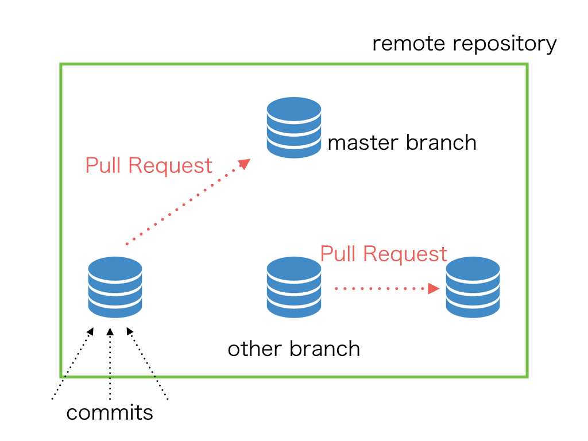

autoscale: true

## タイトル画像

---

## 今日やること
- セルフマネジメント
  - モチベーションの保ち方
  - 一人で始めるコードレビュー
- チームマネジメント
  - 技術の共有について
  - タスク
  - チームで行うコードレビュー

---

## [fit] モチベーションの保ち方

---

# Q&A

---

## [fit] 技術の共有について
- 共有と学習
- チームのコミュニケーション
- 勉強とおかね

---

## 共有の目的

---

## 何を共有するか

---

## 共有の方法

---

# Q&A

---

# チームマネジメント

^次に、チームマネジメントについて取り扱っていきます。
^チームでのプロジェクトは、個人の開発より、良いものができる確率はあがりますが、同時に失敗する可能性も多く注意が必要です。

---

## チーム開発とは

チーム開発は、チームでのサービス開発のことですが、当然ながら世の中には様々なチームの捉え方があります。

---

## チームの大きな分類

まずは、チーム開発は主に2つのチームがあるのではないでしょうか。

- 同じ役割の人で行うチーム開発
- 複数の役割の人で行うチーム開発

前者は、教育的な効果や、作業の並列化による高速化などが効果として考えられます。
後者は、チーム内でスキルを補完しあう効果が考えられます。

^前者でも、完全にチーム内のメンバーの役割が同じなわけではなく、同じ分類の仕事の中でも役割が細かく違うのが常です。ここでの役割とはお互いの業務が補完できるかという点でわけました。
^今回は、主に後者の複数の役割の人で行うチーム開発について見ていきます。

---

# [fit] チームビルディング

---

## チームビルディング

まずは、チームでの開発を行うためにチームに所属しなければいけません。
チーム開発の成功の鍵は、いかに強いチームを作るかということです。

^チームは自然な流れでできるというのが、経験上の皆さんの考え方かもしれないです。
^しかし、自然に作ったチームでは、成功しても自然と成功した以上の成功要因がないでしょう。

---

## 強いチーム？

強いチームとは、どういうものでしょうか？
強いチームは主に以下のような特徴を持ったチームだと、経験上考えられます。

- 議論ができる
- 全員が持っている能力の8割以上を発揮できる
- 全員がチームに所属することで2割以上の成長を遂げられる

^TODO 足す

---

## 作る、入る、育てる

---

## チームを作る

あなたは新しくプロジェクトを始めようと考えているとします。
プロジェクトのオーナーとして、どのようにチームを作っていったらいいかを考えてみましょう。

---

## チーム作りのプロセス

1. プロジェクトの要件（タスク）をまとめる
1. 要件に対する自分の能力を確認する
  1. 問題なく達成できる
  1. 達成できるが時間がかかる
  1. 達成できない
1. チームの規模を決める
1. チームの規模によって自分が出来ない要件を切りわける

---

## チームに入る

あなたは、会社や組織の中でチームに入らなければいけなくなりました。
新しくチームに入る際に、どのようなことに注意するべきでしょうか？

---

## チームに入る準備

- 自分のスキルを整理する
- チームの構成を把握する
- チームの中での役割を確認する

---

## チームに入ってから

- コミュニケーション方法に適応する
- チームの文化を受け入れる
- 自分の働き方を作っておく
- チームの中での自分の役割を増やす

---

# [fit] チーム開発のプロセス

^チーム開発を行う際の基本的な流れについて見ていきましょう。

---

## 開発

1. タスクを出す
2. タスクをコンフリクトしないように分割する
3. コードの管理をする
4. コードレビューをする(理想的には2人)
5. 必要に応じて修正する
6. マージする

---

# 必要な要素

- タスクの分け方
- コード管理のルール
- コミュニケーションのルール

---

# チームで開発するメリット

- いくらプログラミングができても一人では、限界がある
- 考えなければいけない箇所が減る
- 並列で開発が進む
- チーム内で知見を共有しあうことができる

---

# チームで開発するデメリット

- コードの管理やタスクの分割などのコストが増える
- 人のコードを読むことが増えるので、その分のコストはかかる

**※一人一人の生産性は下がるかもしれないが、全体の生産性は高くなる**

---

# 個人とチームの違い

- タスクを分割する重要性
- コードの管理をする
- 相手に読まれるためのコードを書く

---

# Q&A

---

## [fit] コードレビュー

---

## コードレビューとは？
- 自分のコードの評価を自分または他人から受けること
- チーム開発における「コードレビュー」は、Pull Requestのレビューのことを指すことが多い
- チーム開発では、githubを用いたPull Requestベースの開発が一般的になっている。

---

## GitおよびGitHubについて
- Gitについて
- GitHubについて

---

## Gitについて
- バージョン管理を行うためのツール
- 誰がいつどのファイルを書き換えたのか
- どれが最新なのか
- 変更履歴や変更箇所などを記録する

---

---

## GitHubについて
- Gitを用いた開発のプラットフォームを提供するサービス
- Gitにおけるリモートリポジトリ部分の提供をしている
- issueやPullRequestなど開発における便利な機能も提供している

---

## Pull Requestとは(以下PR)
- githubが提供しているチーム開発のための便利機能
- 新規機能や変更などの塊を表す
- commitの塊

---

---

## チームでの開発の流れ
- タスクに基づいてissueを作成する
- issueを元にbranchを気る
- Pull Requestを作成する
- コードレビューをしてもらいマージする

---

# [fit] GIT&GitHub入門

---

## Activity
1. cloneする(pullする)
2. branchを作る
3. README.mdを更新する
4. addする
5. commitする
6. pushする
7. pull requestを作る
8. mergeする

---

## コードレビューの意味
- 品質の向上と属人性の排除
- スキルの向上と知見の共有

---

## 品質の向上と属人性の排除
- 今後、技術的な負債になりそうなコードがないかを確認する
- 知らず知らずに書いてる癖を他の人に見てもらうことによって排除する

---

## スキルの向上と知見の共有
- 指摘することで技術的なスキルを向上させる
- 他人のコードを見ることで、知見を得たりする
- 開発者同士のコミュニケーションの活発化

---

## コードレビューをされる
- PRを作る時に気をつけること
- 綺麗なコードにする

---

## PRを作るときに気をつけること
- 作業途中でもPRを作ったほうがいい
  - diffを見て作業できる。
  - チームの人に自分がどういう作業をしてるかわかりやすい。
- できるだけ小さい単位でPRを作る
  - 大きくなり過ぎると、まともにレビューできない
- What, Howをちゃんと説明とタイトルに書く

---

## 綺麗なコードにする
- 規約に沿っているか
- diffを見て変なものを混ぜていないか
- あとで直そうと思ってたものを直し忘れていないか

---

## コードレビューをする
- どこを見るか
- レビューのコミュニケーション

---

## どこを見るか
- 規約に沿っているか
- PRの説明に書いてあることが実装されているか
- 実際に動作するか
- 疑問に思うところは聞く

---

## レビューのコミュニケーション
- 疑問のある部分は聞く。
- 最後はおなじみ「LGTM!」でオーケーサインを出してあげる

---

## [fit] 一人で始めるコードレビュー

---

## 一人で何ができるの？
- 見てもらう人を探す
- 綺麗だと思うコードを探求する
- 自分のプロジェクトをPRベースで運用する

---

## 見てもらう人を探す
- インターンシップでメンターに見てもらう
- 自分でメンターを探す
- OSSコミュニティでがんばる

---

## 綺麗だと思うコードを探求する
- githubなどのOSSで綺麗なコードを見る。
- 何が綺麗なのかを理解する
- 綺麗がわかれば何が汚いかもわかる

---

## 自分のプロジェクトをPRベースで運用する
- 自分が作ってるアプリやサービスなどをPRベースで開発する
- PRやcommitの単位など、だんだんわかってくる

---

# Q&A

---
