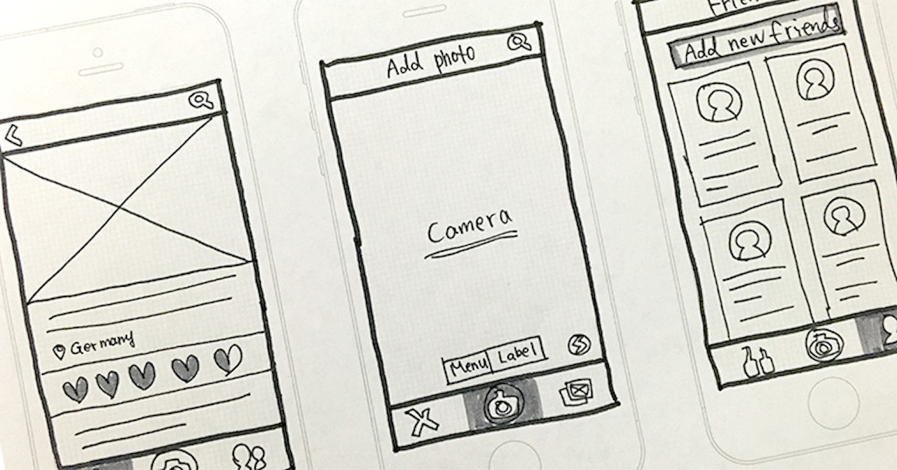
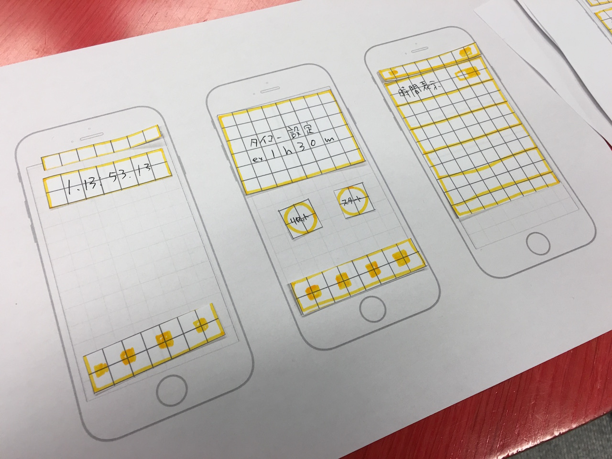

autoscale: true

# Paper ProtoType
# Workshop #1

プロトタイプの大事**"差"**を感じるワークショップ

---

# GOAL
- ６０分でペーパープロトタイピングを体感する
- プロトタイプの大事”差”を感じる
- モックを作る -> 試す -> フィードバックするというサイクルを回す
- つくるものの具体化

--- 

# CONTENTS

- イントロダクション ←いまここ
- ペーパープロトタイピングついて 
- メリット
- 具体例 
- ハンズオン 
- まとめ

---

# CONTENTS

- イントロダクション
- ペーパープロトタイピングついて 
- メリット
- 具体例
- ハンズオン <- ここがメイン
- まとめ

---

# INTRODUCTION

なぜペーパープロトタイプ（モック）が必要なのか

---

# [fit]体験＞ドキュメント

---

#Develop Process 1

企画 -> 文書化 -> 評価 -> 開発 -> 評価

- 文章では伝わらない
- 評価しづらい

---

#Develop Process 2

企画 -> 文書化 -> **モック** -> **評価** -> 開発 -> 評価

- 具体的になる
- 評価しやすい

[イメージ動画](https://vimeo.com/101373355)

---

# [fit]でもモックって大変そうじゃん？

---

# モックとプロトタイプ

- モック（ノーコーディング）
- プロトタイプ（コーディングするよ）	

このワークショップではこの定義で話をするよ

---

# MERITS

- コストがかからない
	1.紙とペンさせあれば出来る
	2.修正も容易
	3.しっかりしたものでも１日あればできる

---

# MERITS
	
- 具体的になる
	1.つくるものがはっきりする
	2.共通意識をもちやすい
	3.必要なものも分かる
	4.優先度を付けれる
	5.アイデアを売れる

---

# MERITS

- ユーザー体験をつくれる
	1.体験を評価できる
	2.テストできる
	3.フィードバックがもらえる

---

# MERITS

- 問題に気づける
	1.見えてなかったことがみえる
	2.なおしかたを話しやすい
	3.修正しやすい

---

# PROTOTYPE TYPES

プロトタイプの種類
右に行けば行くほど具体的

アイデア<文章<モック<プロトタイプ<映像

具体的であればあるほど伝わる
モックとプロトタイプの違い（コードを書くか）

今回やるのはモックの部分

--- 

# [fit]よし、モックやろうぜ

---

# 流れ

1.モック作成（３０分）
2.ペアになってレビュー(各１０分)
3.レビューしている間は操作していない人は動画を撮影
4.レビューを元に修正する（１０分）

---

# SAMPLE

---

# MOCK THEORY?

- 早さ第一
- デザインの詳細ではなく体験設計
- 画面遷移をつくる -> 必要なものを具体化する

---

# WORKSHOP

1.すでに作りたいもののイメージがはっきりしてる人
2.まだ作りたいアプリのイメージがはっきりしない人

---

# すでに作りたいもののイメージがはっきりしてる人

今回のワークショップのゴールを自分の考えを具体的な形にして
誰かに体験してもらおう
Q.使い方はすぐ理解してもらえたか？
Q.体験のデザインは出来ているか
Q.追加したい機能はあったか

---

# まだ作りたいアプリのイメージがはっきりしない人

このワークショップを通して、作るものをはっきりさせよう
アイデア -> ??? -> 完成イメージ
この空欄を埋める作業をする
他のアプリなどを研究するところからはじめてみる

---

# [fit] WORKSHOP1

２０分で作る体験！

---

# [fit] WORKSHOP2

お互いのモックをレビューしよう
（レビューを動画撮影しておくと、あとで見返せてGOOD!）

---

# [fit] WORKSHOP3

フィードバックから修正をしよう！

---

# まとめ

【作る側】
頭の中のイメージをどれだけ出来るか
-> モックを作れば頭の中が具体的になる

---

# まとめ

【ユーザー視点】

-> 人に触ってもらってはじめて見える事が多い
モックは手軽にユーザー体験を作れる

---

# [fit]絵は頭で描くもの。手で描くのではない。

---

# 今回カバーできないこと

- デザインの理論、原則
- UXデザイン
- タイポグラフィ
- マイクロインタラクション、アニメーション

---

# 推薦図書

- なるほどデザイン
- UXデザインの教科書
- 誰のためのデザイン
- インターフェイスデザインの心理学
- タイポグラフィの基本ルール

---

# 次のステップ

プロトタイプしてみる
-> コア機能をつくる
-> デザインイメージを固める
（Skecth3みんな買おう！使い方講座やりたい）

---

# [fit]ANY QUESION?

---

