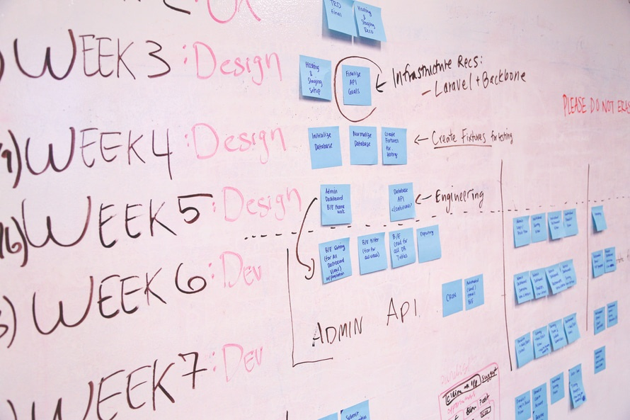

autoscale: true

---

## Summary

- サービス開発
  - プロセス
  - 手法の紹介
  - 仕様書を作る
- チームマネジメント
  - チームビルディング
  - チーム開発のプロセス

^今回は、サービス開発についての回となります。主に、開発の進め方や、実際の手法、仕様の起こし方という形で進めていき、来週には実際に開発に入れればと思います。

---

## TimeSchedule

- 17:00 開始
- 18:00 ???
- 19:00 ???
- 20:00 ???
- 21:00 終了

---

## サービス開発のプロセス

^ まずはサービス開発の大まかな進め方について触れていきましょう

---

## 開発のプロセス

1. 調査
1. コンセプトワーク
1. 仕様作成
1. モックアップ
1. アンケート
1. デザイン
1. 実装
1. テスト

---

## 調査

調査では、既にある競合サービスの調査や、ターゲットユーザーの現状を知るための情報収集を行う工程となります。

^ここで調査した内容を元に、実際のデザインや仕様の作成などを行っていくので自分がまだ把握できていないと思う点に関しては詳しく調査する必要があります。

---

#### 調査する項目

- 先行事例
- 競合サービス
  - 国内（同一マーケット）
  - 海外
- 市場規模
- ターゲット
  - 生活水準
  - 世帯などの、家族構成など

---

### コンセプトワーク

コンセプトワークでは、サービスを一言で表すとなんなのかといった概要。
解決したいユーザーの課題や、ペルソナなど、ユーザーについての説明もここで書きます。

^これは、アイデアの時点で既に出来ている場合が多いかと思いますので、出来ている場合はそのままそれを使用して大丈夫です。

---

#### ユーザーの説明

- ユーザの課題
- 課題へのアプローチ
- ユーザーのペルソナ
- ユーザーストーリー

---

## 仕様作成

仕様の作成は、要件定義であったり色々な呼び方をされると思いますが、この部分が最も重要な工程となります。
デザインや実装などの作業が順調にうまくいくかは、全てこの仕様作成にかかっています。

^主に仕様として、定義するのは以下のようなものになります。

---

### 仕様の項目

- 機能要件
- 画面要件
- 開発要件
- 数値要件

---

### 機能要件

機能要件は、サービスの機能を一覧としてあげ、それについての説明を追加していく工程となります。
機能を考える際、コンセプトで考えたユーザーの課題へのアプローチを元に機能を上げていくと良いでしょう。
また、機能は大きなものから、そこから派生する小さなものを考えていきます。

---

###　画面要件

画面要件は、各画面ごとにどのような機能を持っているべきかという画面単位で切り出す工程となります。
この画面要件が、デザイナーへ伝えるデザインの要件となります。

画面単位で見ると見えない機能などもあると思いますが、それについては大丈夫です。

---

### 開発要件

開発要件は、機能を実現するのに必要な使用技術や、実際の開発のスケジュールなどをざっくりと見積もる工程となります。
実際に、ここで時間が多くかかりすぎるようであれば、初期のリリースに盛り込む機能を減らすなど開発スケジュール全体の調整なども行います。

---

### 数値要件

数値要件は、サービスの具体的なゴールを数字として決める工程となります。
目標としては、例えばアプリのダウンロード数やPV数などをがわかりやすいでしょう。
また、本来の開発であれば開発にかかるコストや、全体の期間などもここで見積もることになります。

---

## モックアップ

モックアップは画面の要件定義に従いながら、全体的なデザインコンセプトの作成や、画面フローの作成を行う工程となります。
モックアップのタイミングではあまり細かいデザインは行わず、画面ごとのパーツの配置などサービス全体を通してのユーザー導線の確認から行っていくのがいいでしょう。

---

## アンケート

アンケートは、ユーザーにモックアップなどを見せ質問を行い、ユーザーの課題に対してどれほど課題を解決できているかの確認を行う工程となります。

---

## デザイン

デザインは、モックアップを元にしながら細かなデザインを作成していく工程となります。
アンケートの結果を踏まえて仕様を消した部分や、デザインで変更をしたほうがいい部分などもここに盛り込みます。

---

## 実装

実装は、サービスを実際に開発していく工程となります。
いきなりコードを書き始めるのではなく、まずは仕様に沿って実装のタスクを上げていき。それぞれのタスクにマイルストーンを定めましょう。

そうすることで、実装がどれだけ遅れているのか、全体でいまどれほど終わっているのかなどの管理が容易になります。

^実装についてはここでは深く扱いません。

---

## テスト

テストは、実装したコードが実際に仕様を満たしているかを確認する工程となります。
テストは、自動で行うもの、手動で行うものなどありますが、まずはテストを行う項目を考えましょう。

---

# 手法の紹介

^実際のサービスの開発の進め方を、実際の手法と共に紹介していきます。

---

## Design Sprint

https://www.gv.com/sprint/

---

## 概要
Design Sprintは、5日間でデザイン、プロタイピング、テストを行うという手法である。これによって、終わりのないディベートや何ヶ月もかかる作業をたった1週間に収めることができる。

---

## 事前準備

---

### 最初のチェックリスト
- 大きな挑戦を選んでいるかß
- フルコミットできる決定者を1人ないしは2人立てる
- 7人以下のスプリントをやるチームを用意する
- 外部の専門家を用意して、短いミーティングを何回か行えるようにする。
- ファシリテーターの存在
- 5日間連続全員が空けられるスケジュールを抑える
- ホワイトボードを2つ用意する

---

### Key Ideas
- パソコンや携帯は使わないし、持ち込まない
- 時間制限を厳しく設けて密度と効率をあげる
- 遅めのランチを食べる。

---

## 月曜日
知識や現状などを全体で共有することで問題への共通理解を構築する。

---

### Key Ideas
- 最終的なゴール地点を想像してそこから逆算して考える。
- 誰も全てを知っている人はいない。
- 「私たちならどうするか」という視点にたち、当事者になってユーザー層をちゃんと定義する

---

## 火曜日
実際に作るというところに力を入れていく2日目。また金曜日にあるユーザーテストについても考え始める時期。

---

### Key Ideas

- 存在しているアイディアの改善や合成をする
- 誰でもペーパーモックは作れる
- ペーパーモックを用いてアイディアを具体化して抽象的なものを詰めていく。
- 全員でやるブレインストーミングは、うまくいかない。それよりも各々に各々のアイディアを詰める時間を与える。

---

## 水曜日

月、火でたくさんのアイディアやモックが発散されている。しかし、現実的にこれを全て試すの無理。水曜はこれを絞っていくことに力を入れる。

---

### Key Ideas

- 具体的な画面遷移などを作って具体化して削っていく。
- 新しい抽象的なアイディアを完全にシャットアウトする。

---

## 木曜日

画面遷移やペーパーモックで作っていたものをプロトタイプにしていく。

---

### Key Ideas

- 学ぶためにプロトタイプを作る。それ以上でも以下でもない。しかも必ず物理的な何かでなければいけない。
- 消費者からの声が聞けるクオリティのプロトタイプを作る。

---

## 金曜日

この日は、ユーザーテストをする。そこから得られるフィードバックを元に現在どれくらいプロジェクトが進んでて、このあと何をしなければいけないかを学びとる。

---

### Key Ideas

- 五人のユーザーからのフィードバックで大まかなパターンが見えてくる
- チームのみんなで見ることが大切。見ることが全員が学ぶことができる。
- そのプロトタイプが成功だったにせよ失敗だったにせよ必ず毎回学べるものがある。

---

# TDD(テスト駆動型開発)

テスト駆動型開発とは、プログラム開発手法の1つでプログラムに必要な各機能について、最初にテストを書き、(テストファースト)そのテストが動作する必要最低限の実装をとりあえず行ったあとにコードを洗練させていくという手法。

---

## そもそもテストがなぜ必要か

実際の開発では、同じプロジェクトのコードが半永久的に書き変えられていく。変更したときに仕様を満たさなくなってしまったり、致命的なバグを無意識なうちに生んでしまうことがある。これを防ぐために動作を保証するためにテストが存在している。

MentorsSchool第5回でもっとこれにフォーカスした内容をやる予定

---

## メリット

テストを書くためには、なるべく分割した疎結合なコードを書かなくてはいけない。実際にテストを書いてみるとわかるが、テストを書くコストは思ってよりも高い。しかしテストファーストであれば、テストが書きやすいような疎結合で綺麗に分割されたコードを書くことができる。つまり結果的に保守性の高いコードを書いていくことができる。

---

## デメリット

そうはいってもテストを書くコストは未だに高い。

---

# スクラム開発
従来のウォーターフォール型の開発に対して、出てきた小規模で高速にPDCAサイクルを回す手法のこと。

---

## ウォーターフォール

要件定義 -> 設計 -> 開発 -> テストといった一方向型の開発手法。
この手法では、プロセスのフェーズがしっかりとわかっていてそれぞれの領域もはっきりしているのでわかりやすいという利点がある。

---

## 重要な要素

- 透明性
- 検査
- 適応

---

## 透明性

- 見える化
- 共通認識
- 正直さ

---

## 検査

- チェックポイント
- 計測

---

## 適応

- 改善

---

## スクラム開発の仕組み
- 反復的に漸進的にプロダクトを届ける
  - 常に動く状態にしておく
  - 常に利用可能な状態しておく
- フィードバックループを回し続ける
  - プロダクトに対するフィードバック
  - プロセスに対するフィードバック

---

## 登場人物
- プロダクトオーナー(責任者)
- 開発チーム
- スクラムマスター(スクラムのプロセスをマネジメントする人)

---

## 必要なもの
- プロダクトバックログ
  - タスクが優先順位順に並べられたリスト
  - プロダクトオーナーが優先順位を決定する
- スプリントバックログ
  - スプリントで実施する開発チームのためのタスクリスト
- インクリメント
  - 完了したタスクのリストとリリ−スの管理

---

1〜4週間という短く固定されたスパン(スプリント)で動くものを作り続ける

---

## 1日の流れ

- タスクの確認と優先順位付け
- スプリントのゴールの共有
- 誰がどのタスクをやってるかなどの確認
- その日やることの共有
- その日なにしたかの報告
- 開発の進捗などの確認

---

# ACTIVITY

---

## アクティビティの流れ

今回は、実際の以下の仕様作成までと、その仕様を実際に人に説明するところまで行ってみましょう。

1. 調査: 15m
1. コンセプトワーク: 15m
1. 仕様作成: 30m
1. プレゼンタイム: 10m

---

## 仕様書のテンプレート

コピーして使用してください

[http://urx3.nu/zk7H](https://paper.dropbox.com/doc/46P1OMXZxrPBNfNNxYAKe)

---

#[fit] 調査 [Time: 15m]

---

#[fit] コンセプトワーク [Time: 15m]

---

#[fit] 仕様作成 [Time: 30m]

---

#[fit] プレゼンタイム [Time: 10m]

---

## まとめ

- サービスが必要かを冷静に見つめ直す
- 仕様書はサービス開発の設計図
- 魅力的な仕様書は、人を引きつける

---

# チームマネジメント

^次に、チームマネジメントについて取り扱っていきます。
^チームでのプロジェクトは、個人の開発より、良いものができる確率はあがりますが、同時に失敗する可能性も多く注意が必要です。

---

## チーム開発とは

チーム開発は、チームでのサービス開発のことですが、当然ながら世の中には様々なチームの捉え方があります。

---

## チームの大きな分類

まずは、チーム開発は主に2つのチームがあるのではないでしょうか。

- 同じ役割の人で行うチーム開発
- 複数の役割の人で行うチーム開発

前者は、教育的な効果や、作業の並列化による高速化などが効果として考えられます。
後者は、チーム内でスキルを補完しあう効果が考えられます。

^前者でも、完全にチーム内のメンバーの役割が同じなわけではなく、同じ分類の仕事の中でも役割が細かく違うのが常です。ここでの役割とはお互いの業務が補完できるかという点でわけました。
^今回は、主に後者の複数の役割の人で行うチーム開発について見ていきます。

---

# [fit] チームビルディング

---

## チームビルディング

まずは、チームでの開発を行うためにチームに所属しなければいけません。
チーム開発の成功の鍵は、いかに強いチームを作るかということです。

^チームは自然な流れでできるというのが、経験上の皆さんの考え方かもしれないです。
^しかし、自然に作ったチームでは、成功しても自然と成功した以上の成功要因がないでしょう。

---

## 強いチーム？

強いチームとは、どういうものでしょうか？
強いチームは主に以下のような特徴を持ったチームだと、経験上考えられます。

- 議論ができる
- 全員が持っている能力の8割以上を発揮できる
- 全員がチームに所属することで2割以上の成長を遂げられる

^TODO 足す

---

## チームを作る or 入る or 育てる

---

## チームを作る

あなたは新しくプロジェクトを始めようと考えているとします。
プロジェクトのオーナーとして、どのようにチームを作っていったらいいかを考えてみましょう。

---

## チーム作りのプロセス

1. プロジェクトの要件（タスク）をまとめる
1. 要件に対する自分の能力を確認する
  1. 問題なく達成できる
  1. 達成できるが時間がかかる
  1. 達成できない
1. チームの規模を決める
1. チームの規模によって自分が出来ない要件を切りわける

---

## チームに入る

あなたは、会社や組織の中でチームに入らなければいけなくなりました。
新しくチームに入る際に、どのようなことに注意するべきでしょうか？

---

## チームに入る準備

- 自分のスキルを整理する
- チームの構成を把握する
- チームの中での役割を確認する

---

## チームに入ってから

- コミュニケーション方法に適応する
- チームの文化を受け入れる
- 自分のデファクトスタンダードを作っておく
- チームの中での自分の役割を増やす

---

# [fit] チーム開発のプロセス

^チーム開発を行う際の基本的な流れについて見ていきましょう。

---

## 開発

1. タスクを出す
2. タスクをコンフリクトしないように分割する
3. コードの管理をする
4. コードレビューをする(理想的には2人)
5. 必要に応じて修正する
6. マージする

---

# 必要な要素

- タスクの分け方
- コード管理のルール
- コミュニケーションのルール

---

# チームで開発するメリット

- いくらプログラミングができても一人では、限界がある。
- 考えなければいけない箇所が減る。
- 並列で開発が進む。
- チーム内で知見を共有しあうことができる。

---

# チームで開発するデメリット

- コードの管理やタスクの分割などのコストが増える。
- 人のコードを読むことが増えるので、その分のコストはかかる。

## 一人一人の生産性は下がるかもしれないが、全体の生産性は高くなる。

---

# 個人とチームの違い

- タスクを分割する重要性
- コードの管理をする
- 相手に読まれるためのコードを書く
