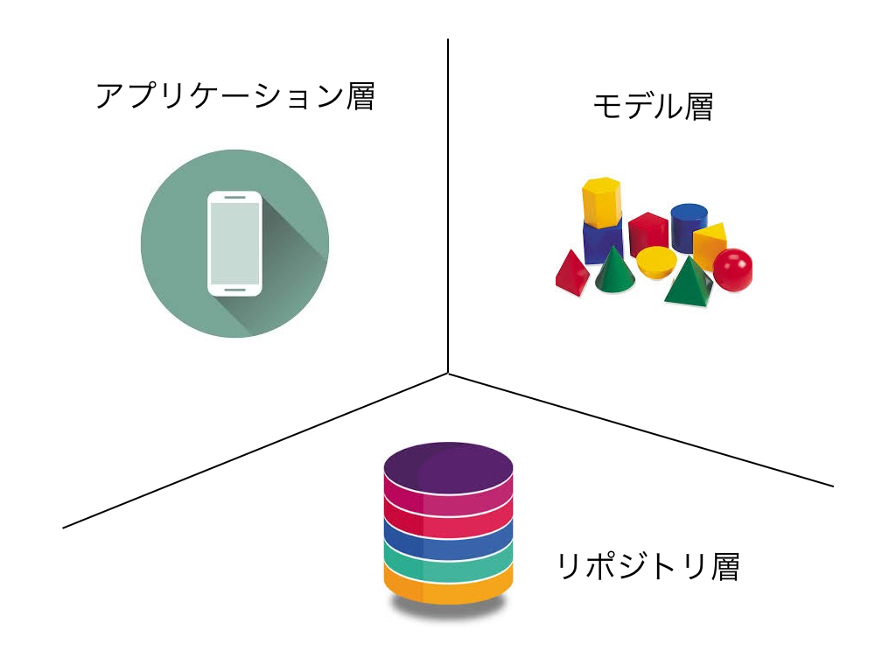
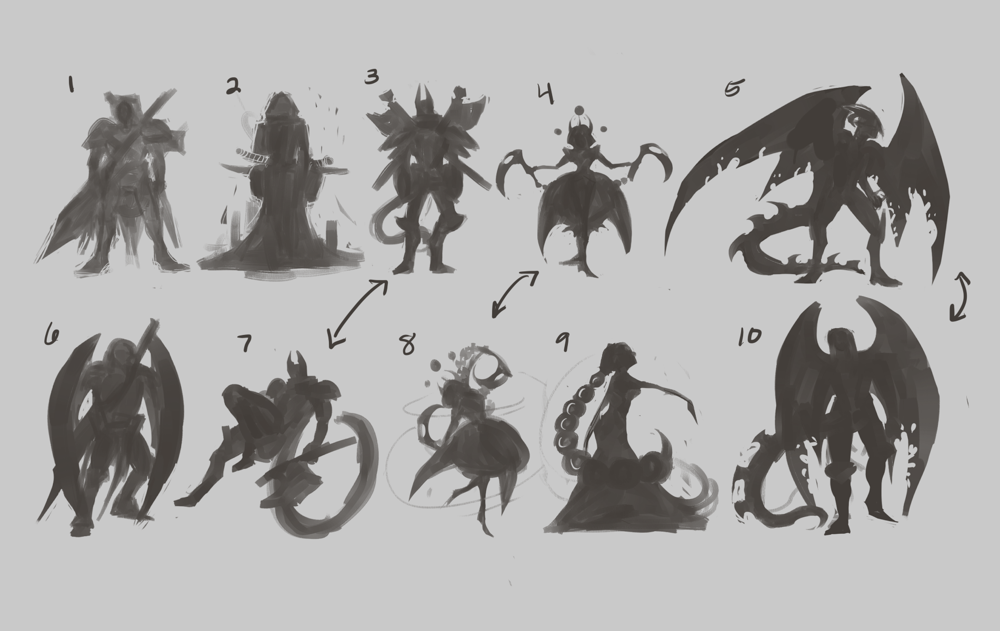
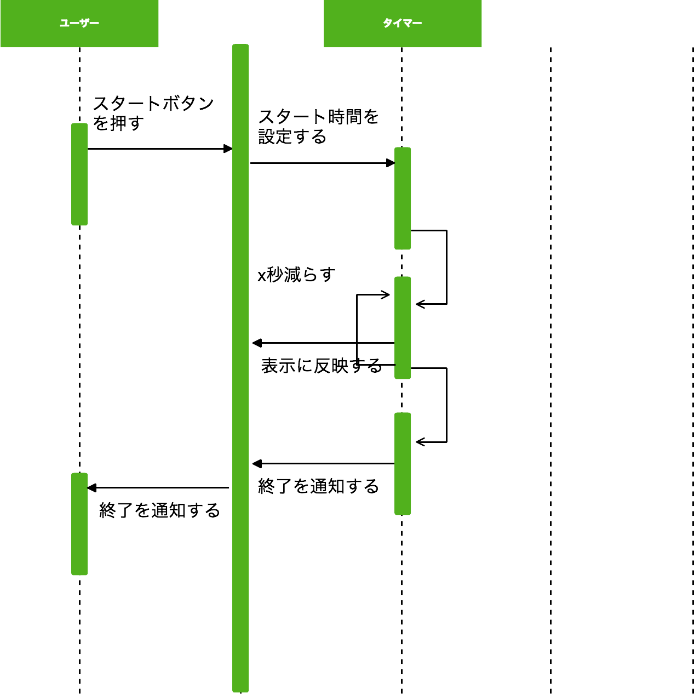

autoscale: true


## 後半戦
- 設計について
- コーディングについて

---


## [fit] 設計

---


## 設計は何のために必要か
- 最小限のコストで開発するため
- 修正や機能追加に対応するため
- チームメンバーが共通の言語を持つため

---


## 最小限のコストで開発するため
- 何を作るか、何をすればいいかが明確になる
- タスクが最初にわかるので、チーム内などで作業が分割できる
- スケジュールが立てやすい

---


## 修正や機能追加に対応するため
- 開発途中での仕様変更などにかかるコストを抑えることができる
- リリースが終わったあとは、そのコードは半永久的に変更されていく
- 変更箇所を局所化する
- ライブラリなど差し替えを他を変更することなく行えるようにする

---


## チームメンバーが共通の言語を持つため
- チーム内でそのソフトウェアに対して共通認識をしっかりと持つため
- チームにはエンジニアではない人も当然いる
- 設計があれば、共通言語を使って会話することができる

--

-> 「ユーザーがログインしてない状態でこのボタンを押した場合はどういう結果になりますか？」や「この画面での操作は、キャンセルと完了だけです」とかの会話がスムーズにすることができる

---


## 設計をする時に気をつけること
- スケールするときのことを考える
- 新しく開発メンバーが入ったときのことを考える
- それぞれの役割の間にしっかりと境界線を引く

---


## スケールするときのことを考える
- サービスのコードはリリースされれば終わりではなく、半永久的に書き加えられていく
- そのときに修正にコストがかかってしまっては、開発が詰まってしまう

---


## 新しく開発メンバーが入ったときのことを考える
- 設計やパッケージや開発のルールなどをしっかりと定めて、開発者が加わったり変わったりしても変わらず開発が継続できるようにする必要がある
- エンジニアじゃない人にも伝わるように言語化する
- 仕様やモデルなどは文章化しておく
  - APIの仕様
  - モデルのメンバーと関数
  - 使ってるライブラリや開発環境

---


## それぞれの役割の間にしっかりと境界線を引く。
- 大体のサービスには以下のような機能がある
  - モノ
  - アクション
  - データ処理
- これらの層を明確に分ける

---



---


## ドメイン駆動設計(DDD)
- ソフトウェアの設計手法
- ドメインモデルの設計を中心に考える

---


## ドメインモデルとは
- 登場するモデルが何をするか(できるか)を定義したものをドメインモデルと呼ぶ
- これを中心にコードに落とし込んでいく設計をドメイン駆動設計と呼ぶ

---


## なぜドメイン駆動設計なのか
- ドメインモデルを中心に設計することで、「誰(何)が何をする」に関してチーム内での共通な言語ができる
- モデルを中心にしてレイヤー(層)を分割するので自ずと変更に強い設計になる

---


## どうやる？
- ドメインモデルを設計することが最も重要である
- どんなモデルがどういうアクションを持つかを全員で決める
- それを元にコードベースにどんどん落とし込んでいく

---


## UML図ってなに
- Unified Modeling Languageの略
- モデルやユースケースなどを図にすることでわかりやすい形で記述する

---


---


---


---


## モデルを使って設計の中心を決めていく
- どんな登場人物がいるのか
- それらは情報として何を持つのか
- それらが持ってるアクションは何か
- それによってデータ層にどんな問い合わせをする必要があるか

---


## コードに落とし込んでいく
- UML図を参考にコードを書いていく
- データの流れなどより具体的に決めなければいけないことも出てくる

---


## (参考)デザインパターン
- ドメイン駆動設計に必須なのがオブジェクト指向
- オブジェクト指向プログラミングでプログラムを組むパターン

---


## 結城浩さんの「Java言語で学ぶデザインパターン入門」
- 23種類のオブジェクト指向に基づくデザインパターンを紹介している
- 図が多く使われていて、とてもわかりやすい

---


---


## [fit] ACTIVITY

---


## 今日やること
1. 自分が作りたいサービスの登場人物(モノ)を出す
2. 画面ごとにコンポーネント(ボタンなどのパーツ)を出す
3. ユーザー×コンポーネントでアクションを作っていく
4. アクションを選んでデータの流れを作る
5. そのモデルにどんな情報が必要かを考える

---


---


## [fit] 1.自分が作りたいサービスの登場人物を出す

---


## タイマーの場合
- ユーザー
- タイマー

---


## [fit] 2.画面ごとにコンポーネント(ボタンなどのパーツ)を出す

---

## タイマーの場合
A.
  - 残り時間表示エリア
  - スタートボタン
  - リセットボタン
  - 画面遷移ボタン
B.
  - 時間設定+ボタン
  - 時間設定-ボタン
  - 時間設定表示エリア
  - スタートボタン
  - リセットボタン
  - 画面遷移ボタン

---


## [fit] 3.ユーザー×コンポーネントでアクションを作っていく

---


# ユーザー × Aのコンポーネント
- ユーザーがスタートボタンを押す
- ユーザーがリセットボタンを押す
- ユーザーが画面遷移ボタンを押す

---


# ユーザー × Bのコンポーネント
- ユーザーが時間設定+ボタンを押す
- ユーザーが時間設定-ボタンを押す
- ユーザーがスタートボタンを押す
- ユーザーがリセットボタンを押す
- ユーザーが画面遷移ボタンを押す

---


## [fit] 4.アクションを選んでデータの流れを作っていく

---



---


## [fit] 5.そのモデルにどんな情報が必要かを考える

---


## タイマーの場合
- ユーザー
  - 特にない
- タイマー
  - 時間
  - 1回で減らす時間

---


## Q&A

---


## [fit] コーディング

---


## 見やすいコード
- 関数や変数の命名
- 責務が1つでわかりやすい
- 最低限のコメント

---


## 関数や変数の命名
- シンプルかつ明確
- 何をするか名前でわかる
- getやsetなどその言語の流儀があるのでそれになるべく合わせる

--

-> 裏を返せば、これができない場合は何かしら曖昧な点がある

---


## 責務が1つでわかりやすい
- 責務を1つにしないと関数を使う側が意図しないことになる場合が多い
- 使い回しが難しくなってしまう

---


## 使い回しが難しい例

```
function cook卵焼き(){
  // 卵を割る処理
  ...

  // 卵をかき混ぜる
  ...

  // 火をつける処理
  ...

  // 卵を焼く処理
  ...

  // 盛り付ける
  ...
}
```

---


## 全てを別で分離して組み合わせる

```
function do卵を割る(){...}
function do卵をかき混ぜる(){...}
function do火をつける(){...}
function do卵を焼く(){...}
function do盛り付ける(){...}
```

---


```
function cook卵焼き(){
  do卵を割る();
  do卵をかき混ぜる();
  do火をつける();
  do卵を焼く();
  do盛り付ける();
}

function cook目玉焼き(){
  do卵を割る();
  do火をつける();
  do卵を焼く();
  do盛り付ける();
}
```

---


## 最低限のコメント
- コメントが多いと読みづらくなってしまう
- コメントが少なすぎると相手がコードを読まないといけなくなる
- 自分がゼロ知識に戻ったときにわかりづらいところだけをコメントとして残す

--

-> 何箇所も書かなければいけないのは、コードが悪い

---


## 規約のあるコード
- 属人化を避けることができる
  - コードに個性がなくなって誰が書いても同じコードになる
- 共通認識ができてコミュニケーションがスムーズに取れる
- 自転車置き場の議論を避けることができる

---


## 自転車置き場の議論
- Bikeshed discussion
- インデントや空白の位置などの本質的じゃない議論のこと
- 実際のチーム開発では、そういう議論がごろごろしてる
- これがあると、開発効率や開発のストレスが著しく落ちる

--

-> 規約があれば、このような議論に時間を費やす必要もなくなる

---


## 変更に強いコード
- 心がけ
  - 最小限の変更で済む
  - 変更が他の場所に及ばない

---


## Q&A

---
