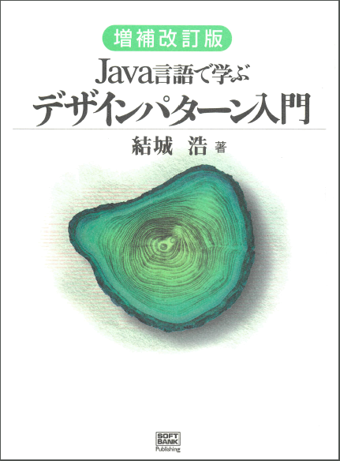

autoscale: true


---


## 開発の進め方

---


## 開発の主なステップ

1. 技術検証
2. タスク出し
3. モックアップ
4. ロジック層の作成
5. 設計
6. テスト・検証

※開発のステップに正解はないが、人によってどういう順番でやるかで効率が変わる

---


### 技術検証

技術検証は、使用する技術が本当に想定通りに使えるのかを確認する工程となります。
例えば、ここで想定通り使用できない技術を使用していたり、実装が出来ない場合などは、その技術を使用するか、または機能を実装するかを実際に検討しなければいけません。

---


### タスク出し

タスク出しは、開発のタスクを細分化して出す工程となります。タスクを最初にしっかりと出すことで、開発全体の見通しが良くなり、自分の進捗なども管理がしやすくなります。
また、タスクを出す際は大体そのタスクにどれくらいの時間がかかるのかを見積もるようにしましょう。
詳しくどのようにタスクを出すかは、アクティビティで行っていきます。

---


### モックアップ

モックアップは、まずはUIや全体の画面遷移など、サービスの側を作成する工程となります。
UIは最も変更が多い部分なので、開発終盤で多いなUIの改修が入ると確実にリリースが遅れます。
また、先にUIを作ることで、チーム全体でサービスのイメージを固めることにも役に立ちます。

---


### ロジック層の作成

ロジック層の作成は、モックアップで作成したサービスの裏側の部分を作成していく工程となります。

---


### 設計

設計は、モックアップなどプログラムを書いてきた中で煩雑になっている部分を、一度コード全体の構成を見直し、再配置することで見直すというものです。
設計にはいくつかの思想があり、その思想にそってどの部分のコードが煩雑になっているかを考えるところからスタートしましょう。
詳しい設計の話は、後半で行っていきます。

---


### テスト・検証

テスト・検証は、実装したコードが仕様通りに動作するかの確認を行う工程となります。
テストや検証でチェックする項目は、仕様を作成する時点で作成しているのが望ましいです。
また、テストなどで注意する項目としては今まで開発を行っていた開発の環境とは別の環境で動作するかということです。

---


### 普段の自分の開発ステップを書き出そう

大体でいいので、普段の開発の段取りを上げてみましょう。

1.
2.
3.
4.
5.

---


### 他の人の開発のスタイルを見てみよう

同じテーブルの人の開発手順を見て、自分の開発手順と比較してみましょう。

---


## チケット駆動開発入門

---


### 概要

今回は、GitHub Projectsを使用してかんばん方式のチケット管理を行っていきます。

---


### 用意するもの

- GitHubのアカウント
- GitHubのリポジトリ

---


### 準備

- GitHub Projectsでプロジェクトを作成します
- `+Add Column`を押して、Progress、Doneを用意します

---


### Todoを用意する

先程、Columnを用意した際にTodoに当たるColumnを用意しませんでした。
ここには、先程あげた開発のステップを書きましょう。

Columnの順番は、タスクを消費するグループで並べましょう。

---


---


### タスクとしてチケットを作りましょう

開発のタスクをチケットとして作成していきましょう。
とはいっても、チケットの出し方がわからない人が多いと思いますので、チケットを出す際のポイントを幾つかお伝えします。

---


#### どこからチケットを出すか

- 画面仕様
- 機能仕様
- 他の人に確認してもらおう

---


#### チケットの粒度を合わせる

１つのチケットは、4時間以内に終わるタスクにしましょう

---


### チケットに優先順位をつけよう

チケットを上下で並び替えて優先順位を付けましょう
右上から下に向かってチケットを消費し、その後隣のTodoに移るような流れがいいでしょう

---


### マイルストーンを定めよう

タスクをいつごろまでにやるか、2週間ごとなどのスパンで切ってみましょう。
ちょうど、MentorsSchoolが2週間ごとなのでそれに合わせて切ってみるのもおすすめです。

---


# コーディング

---


## 後半戦

- 設計について
- コーディングについて

---


## [fit] 設計

---


## 設計は何のために必要か

- 最小限のコストで開発するため
- 修正や機能追加に対応するため
- チームメンバーが共通の言語を持つため

---


## 最小限のコストで開発するため

- 何を作るか、何をすればいいかが明確になる
- タスクが最初にわかるので、チーム内などで作業が分割できる
- スケジュールが立てやすい

---


## 修正や機能追加に対応するため

- 開発途中での仕様変更などにかかるコストを抑えることができる
- リリースが終わったあとは、そのコードは半永久的に変更されていく
- 変更箇所を局所化する
- ライブラリなど差し替えを他を変更することなく行えるようにする

---


## チームメンバーが共通の言語を持つため

- チーム内でそのソフトウェアに対して共通認識をしっかりと持つため
- チームにはエンジニアではない人も当然いる
- 設計があれば、共通言語を使って会話することができる

--

-> 「ユーザーがログインしてない状態でこのボタンを押した場合はどういう結果になりますか？」や「この画面での操作は、キャンセルと完了だけです」とかの会話がスムーズにすることができる

---


## 設計をする時に気をつけること

- スケールするときのことを考える
- 新しく開発メンバーが入ったときのことを考える
- それぞれの役割の間にしっかりと境界線を引く

---


## スケールするときのことを考える

- サービスのコードはリリースされれば終わりではなく、半永久的に書き加えられていく
- そのときに修正にコストがかかってしまっては、開発が詰まってしまう

---


## 新しく開発メンバーが入ったときのことを考える
- 設計やパッケージや開発のルールなどをしっかりと定めて、開発者が加わったり変わったりしても変わらず開発が継続できるようにする必要がある
- エンジニアじゃない人にも伝わるように言語化する
- 仕様やモデルなどは文章化しておく
  - APIの仕様
  - モデルのメンバーと関数
  - 使ってるライブラリや開発環境

---


## それぞれの役割の間にしっかりと境界線を引く。
- 大体のサービスには以下のような機能がある
  - モノ
  - アクション
  - データ処理
- これらの層を明確に分ける

---


---


## ドメイン駆動設計(DDD)
- ソフトウェアの設計手法
- ドメインモデルの設計を中心に考える

---


## ドメインモデルとは
- 登場するモデルが何をするか(できるか)を定義したものをドメインモデルと呼ぶ
- これを中心にコードに落とし込んでいく設計をドメイン駆動設計と呼ぶ

---


## なぜドメイン駆動設計なのか
- ドメインモデルを中心に設計することで、「誰(何)が何をする」に関してチーム内での共通な言語ができる
- モデルを中心にしてレイヤー(層)を分割するので自ずと変更に強い設計になる

---


## どうやる？
- ドメインモデルを設計することが最も重要である
- どんなモデルがどういうアクションを持つかを全員で決める
- それを元にコードベースにどんどん落とし込んでいく

---


## UML図ってなに
- Unified Modeling Languageの略
- モデルやユースケースなどを図にすることでわかりやすい形で記述する

---


---


---


---


## モデルを使って設計の中心を決めていく
- どんな登場人物がいるのか
- それらは情報として何を持つのか
- それらが持ってるアクションは何か
- それによってデータ層にどんな問い合わせをする必要があるか

---


## コードに落とし込んでいく

- UML図を参考にコードを書いていく
- データの流れなどより具体的に決めなければいけないことも出てくる

---


## (参考)デザインパターン

- ドメイン駆動設計に必須なのがオブジェクト指向
- オブジェクト指向プログラミングでプログラムを組むパターン

---


## 結城浩さんの「Java言語で学ぶデザインパターン入門」

- 23種類のオブジェクト指向に基づくデザインパターンを紹介している
- 図が多く使われていて、とてもわかりやすい

---



---


## [fit] ACTIVITY

---


## 今日やること

1. 自分が作りたいサービスの登場人物(モノ)を出す
2. 画面ごとにコンポーネント(ボタンなどのパーツ)を出す
3. ユーザー×コンポーネントでアクションを作っていく
4. アクションを選んでデータの流れを作る
5. そのモデルにどんな情報が必要かを考える

---


---


## [fit] 1.自分が作りたいサービスの登場人物を出す

---


## タイマーの場合

- ユーザー
- タイマー

---


## [fit] 2.画面ごとにコンポーネント(ボタンなどのパーツ)を出す

---


## タイマーの場合

A.
  - 残り時間表示エリア
  - スタートボタン
  - リセットボタン
  - 画面遷移ボタン
B.
  - 時間設定+ボタン
  - 時間設定-ボタン
  - 時間設定表示エリア
  - スタートボタン
  - リセットボタン
  - 画面遷移ボタン

---


## [fit] 3.ユーザー×コンポーネントでアクションを作っていく

---


# ユーザー × Aのコンポーネント

- ユーザーがスタートボタンを押す
- ユーザーがリセットボタンを押す
- ユーザーが画面遷移ボタンを押す

---


# ユーザー × Bのコンポーネント
- ユーザーが時間設定+ボタンを押す
- ユーザーが時間設定-ボタンを押す
- ユーザーがスタートボタンを押す
- ユーザーがリセットボタンを押す
- ユーザーが画面遷移ボタンを押す

---


## [fit] 4.アクションを選んでデータの流れを作っていく

---


---


## [fit] 5.そのモデルにどんな情報が必要かを考える

---


## タイマーの場合

- ユーザー
  - 特にない
- タイマー
  - 時間
  - 1回で減らす時間

---


## Q&A

---


## [fit] コーディング

---


## 見やすいコード

- 関数や変数の命名
- 責務が1つでわかりやすい
- スコープを考える
- 最低限のコメント

---


## 関数や変数の命名

- シンプルかつ明確
- 名前から役割がわかる
-

---


## 責務が1つでわかりやすい

- 副作用を明確にする
- 何をするか * 何に対してするか
- 使い回しが難しくなってしまう

---

## スコープを考える

- どのクラスが、その関数を使えるか
- どのクラスが、その関数を編集できるか
- 権限を絞ることで事故を防ぐ

---


## 最低限のコメント

- コメントが多いと読みづらくなってしまう
- コメントが少なすぎると相手がコードを読まないといけなくなる
- トリッキーな実装にはコメントが必須

---


## 使い回しが難しい例

```
function cook卵焼き() {
  // 卵を割る処理
  ...

  // 卵をかき混ぜる
  ...

  // 火をつける処理
  ...

  // 卵を焼く処理
  ...

  // 盛り付ける
  ...
}
```

---


## 全てを別で分離して組み合わせる

```
function do卵を割る() {...}
function do卵をかき混ぜる() {...}
function do火をつける() {...}
function do卵を焼く() {...}
function do盛り付ける() {...}
```

---


```
function cook卵焼き() {
  do卵を割る();
  do卵をかき混ぜる();
  do火をつける();
  do卵を焼く();
  do盛り付ける();
}

function cook目玉焼き() {
  do卵を割る();
  do火をつける();
  do卵を焼く();
  do盛り付ける();
}
```

---


## 規約のあるコード

- 属人化を避けることができる
- チームの文化を作りやすい
- 自転車置き場の議論を避けられる

---


## 自転車置き場の議論

- Bikeshed discussion
- インデントや空白の位置などの本質的じゃない議論のこと
- 実際のチーム開発では、そういう議論がごろごろしてる
- これがあると、開発効率や開発のストレスが著しく落ちる

---


## 何を規約として書くか

- 命名規則
- コードへの考え方
- 手順の複数ある書き方のプラクティス

---


## 変更に強いコード

- 最小限の変更で済む
- 変更が他の場所に及ばない

---


## Q&A
